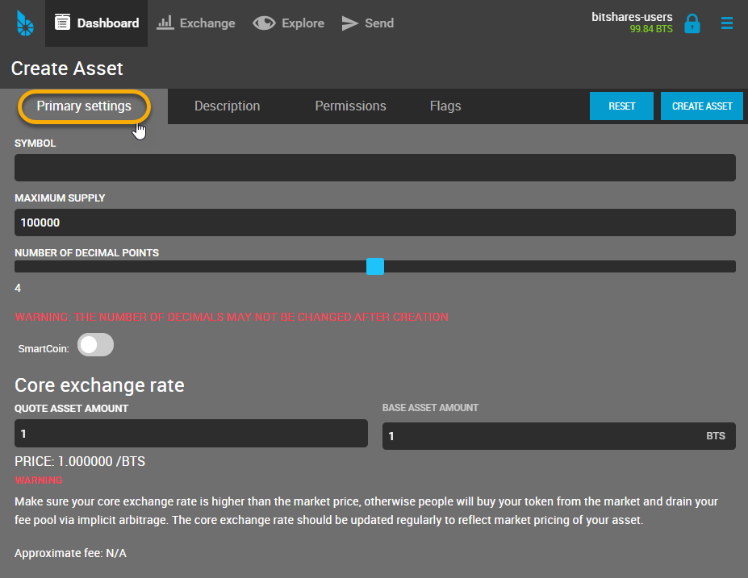
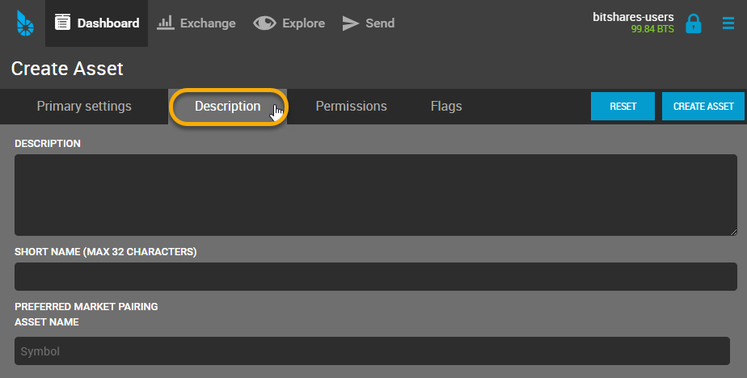
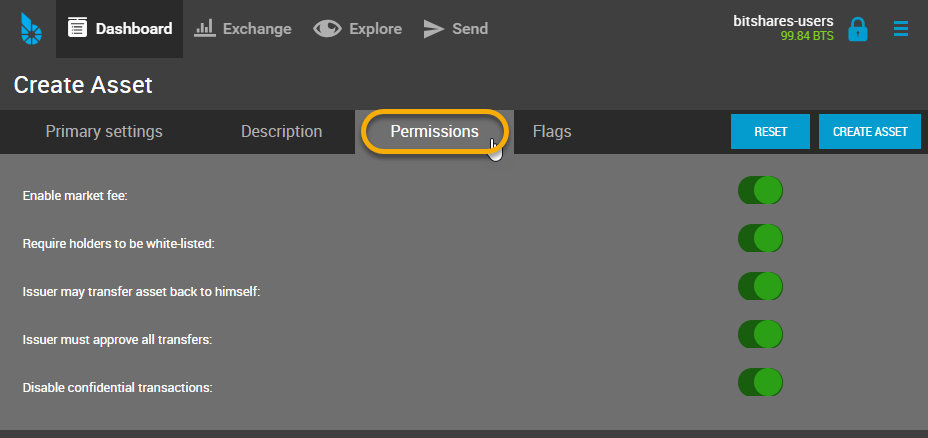
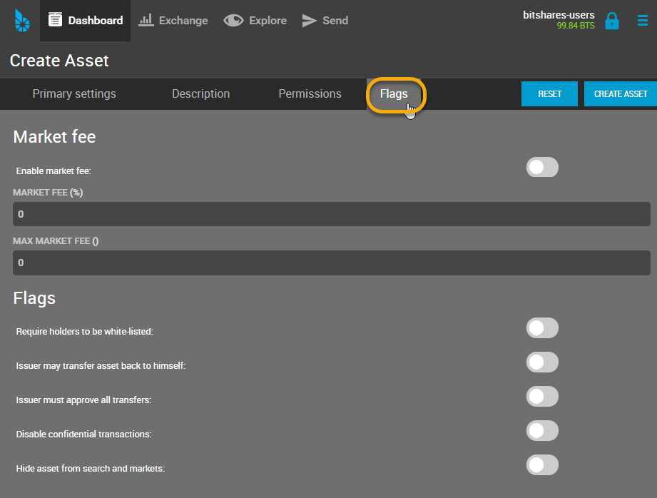
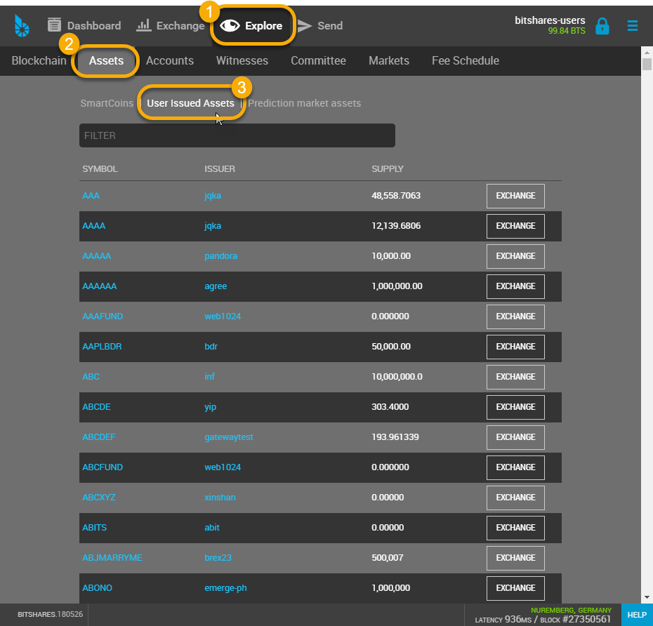

# Creating a new UIA (GUI) {#creating-new-uia-gui}

::: {.contents local=""}
Table of Contents
:::

------------------------------------------------------------------------

## Create Asset Feature

Go to **\[Settings\]** - **\[Create Asset\]**

1.  Click \[CREATE ASSET\]

{.align-center width="150px"}

{.align-center width="600px"}

### Primary Settings

{.align-center width="600px"}

To allow transaction fees to be paid in the native asset, a core
exchange rate is required at which a customer can implicitly trade the
UIA into BTS from the asset's *fee pool*.

This also requires that the fee pool is funded (e.g. by the issuer).
Since all prices in BitShares are internally represented as *fractions*
(i.e. a/b), we need to define a ratio between quote (the UIA) and base
(BTS), i.e. the numerator and denominator for price = a/b

Symbol

:   The Symbol defined here will be reserved in the system for your
    assets. One the asset is created, the symbol cannot be changed
    again.

Maximum Supply

:   This is also a permanent setting and denotes the maximum amount of
    shares that can ever exist at the same time. Please consult the
    Networks fees in the explorer!

Number of Decimal Points

:   This is used to denoted the number of decimal places. A 0 will
    result in an asset that cannot be separated below integer amounts
    (e.g. 1, 2, ..)

SmartCoin

:   \--

Quote Asset Amount

:   Core exchange rate

Base Asset Amount

:   Core exchange rate

> [!NOTE]
> Symbols with less than 5 characters are very expensive. Please consult
> the Networks fees in the explorer!

### Description

{.align-center width="600px"}

Description

:   description can be used to let everyone know the purpose of the
    asset, or an internet address for further information.

Short Name

:   Short Name is also a permanent setting and denotes the maximum
    amount.

Preferred Market Pairing

:   \--

Asset Name

:   \--

### Permissions (Optional)

{.align-center width="600px"}

Even though the default settings should be fine for most UIAs, we have
the option to opt-out of some available features. (By default, or
permissions are enabled).

> [!NOTE]
> Once a permission has been set to false, the permission cannot be
> reactivated!

We have the options to opt-out of:

- Enabling Market Fees
- Requiring holders to be white-listed
- Issuer may transfer asset back to himself
- Issuer must approve all transactions
- Disable confidential transactions

> [!NOTE]
> that setting these permissions does not imply that the features is
> enabled. To do so, we would also require to enable the corresponding
> flag(s). (See below)

### Flags (Optional)

The flags are used to actually enable a particular features, such as
market fees or confidential transfers.

If we have set the permission to have a market fee, we can enable the
market fees here and set a percentage and max. fee.

We here also can enable the requirements for users to be white-listed,
enable confidential transfers and give the issuer the power to withdraw
its asset from customer accounts.

{.align-center width="600px"}

### The asset creation fee

The asset creation fee depends on the length of your symbol. 3 Character
Symbols are the shortest and are rather expensive while symbols with 5
or more characters are significantly cheaper.

50% of the asset creation fee are used to pre-fill the assets fee pool.
From the other 50%, 20% go to the network and 80% go to the referral
program. This means, that if you are a life-time member, you get back
40% of the asset creation fee after the vesting period (currently 90
days).

------------------------------------------------------------------------

## View existing Asset

Go to **\[Explore\]** - **\[Asset\]** - **\[User Issues Assets\]**

{.align-center width="600px"}

------------------------------------------------------------------------
