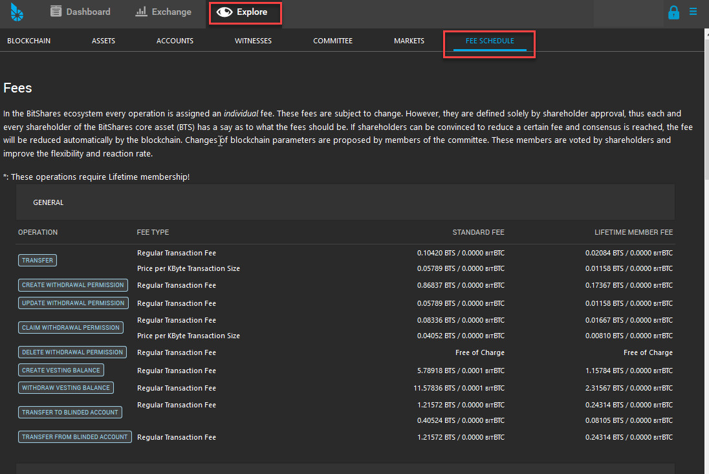

# Fees {#bts-fees}

In the BitShares Blockchain Network, every operation is assigned an
individual fee. Each operation has different transaction fee. You can
check each operation fee schedule if you are interested.

::: contents
Table of Contents
:::

------------------------------------------------------------------------

## Fee Types

There are different Transaction Fee Types. And each operation has own
transaction fee amount. Some operations ask Regular Transaction Fee and
Price of per KByte Transaction Size.

For instance, *Transfer operation* asks both (Regular Transaction Fee
and Price of per KByte Transaction Size) fees. The *Price per KByte
Transaction Size* comes from a size of memo you send. The memo is
encrypted by default and can only be decrypted by the participants of
the transfer. It\'s safe to use to sens a message. However, the transfer
fee depends on the length of the memo.

You can use the memo section to send a message. Also, some transactions
require you to input a necessary information in the memo section. Be
sure if you put each information in a correct place before you confirm
your transaction!

-   **Fee Types**
    -   Regular Transaction Fee
    -   Price per KByte Transaction Size
    -   Symbols with 3 Characters (Create Asset Operation)
    -   Symbols with 4 Characters (Create Asset Operation)
    -   Longer Symbols (Create Asset Operation)
    -   Basic Fee (Create Account)
    -   Fee for Premium Names (Create Account)
    -   (Lifetime Membership Fee)
-   **Fee Schedules**
    -   You can find [each Operation Fee List
        here.](https://wallet.bitshares.org/#/explorer/fees)

**Example: Fee Schedule View**

{.align-center width="650px"}

| 

### Paying Fees

Each time you perform an activity (i.e., send fund, place an order,
etc), you pay a small amount of fee. Any transaction fee can be paid by
paying any asset that has a Core exchange rate (i.e., price) at which
the asset can be exchange implicitly into BTS to cover the network fee.
When you confirm your activity (transaction), you can see a fee amount
for the transaction.

Order Cancellation \^\^\^\^\^\^\^\^\^\^\^\^\^\^\^\^

If you cancel an order that has not been fully or partially filled, 90%
of the fee will be payed back to your account. However, this cashback
will be in BTS (CORE token) and not in the asset you have originally
paid the fee in.

| 

## Standard Fee and Lifetime Membership Fee

Your transaction fees depend on your membership status. If you are a
Basic Member, you pay \"Standard Fee\". And if you are a Lifetime
Member, you pay \"Lifetime Member Fee\".

**20%** of each transaction fee goes to the network. And if you are a
**Lifetime Members, you get cashback of 80% of the fee** you payed.

For many cases it may make sense to upgrade the account even though you
don't want to participate in marketing at all simply for the reasons to
get a cashback of 80% of the fees you pay for your own transactions!

:::: note
::: title
Note
:::

Technically, the fees that you pay stay the same, but a part of the fees
is refunded in the form of a **vesting balance**. Once the fees have
vested you can withdraw them.
::::

| 

## Asset Creation Fee

We talked about \"Transfer Operation\" Fees. Some of the transfer fees
depend on the length of the memo. Similarly, an **Asset Creation Fee**
depends on the length of your asset symbol. **Three (3) Character
Symbols** are the shortest and are rather expensive while symbols with
**five (5) or more characters** are significantly cheaper.

**50%** of the asset creation fee is used to pre-fill the assets fee
pool. From the other **50%**, **20% go to the network and 80% go to the
referral program**. This means that if you are a lifetime member, you
get back 40% of the asset creation fee after the vesting period
(currently 90 days).

### How to Profit by Issuing an Asset

There are many ways to profit from issuing an asset. As the issuer you
have complete control over market fees and can tune parameters such as
the percent of each trade that is collected as a fee. This percentage
can be bounded by a minimum and maximum fee. The combination of these
three parameters give issuers great flexibility in pricing.

### Fee Pools

Issuers may optionally maintain a Fee Pool. The **Fee Pool is a pool of
BTS** and an exchange rate at which the issued asset may be converted
into BTS. When a user wishes to pay a network fee with the asset, the
fee pool will step in to convert the asset into BTS at the rate that the
issuer has specified. This means that issuers may charge a premium every
time users opt to use their asset to pay network fees rather than paying
them directly with BTS.

:::: note
::: title
Note
:::

The purpose of the fee pool is **to provide a convenience to users that
would like to use an asset without concerning themselves with the
details of acquiring BTS**. Anyone may fund the fee pool, but only the
issuer may specify the exchange rate. This exchange rate is
automatically set to the settlement price if the asset is collateralized
by BTS.
::::

If the assets fee pool is funded, the fees can be payed in the native
UIA instead of BTS.

| 
