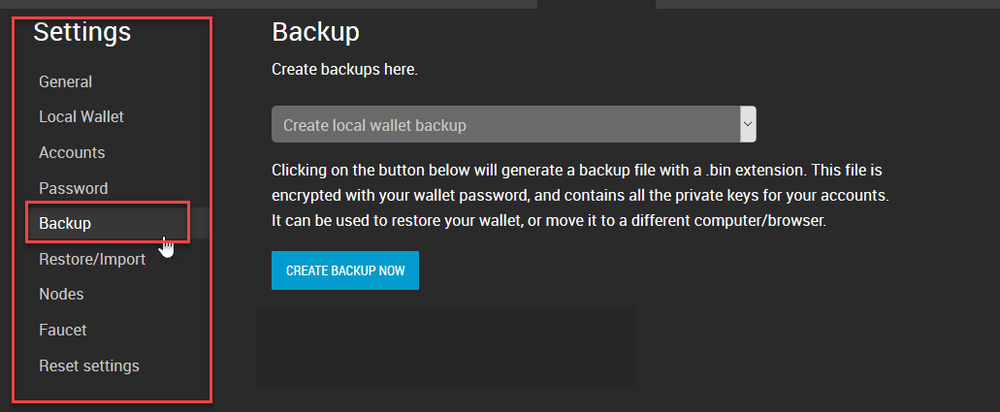
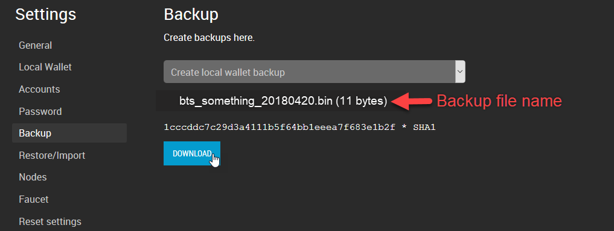
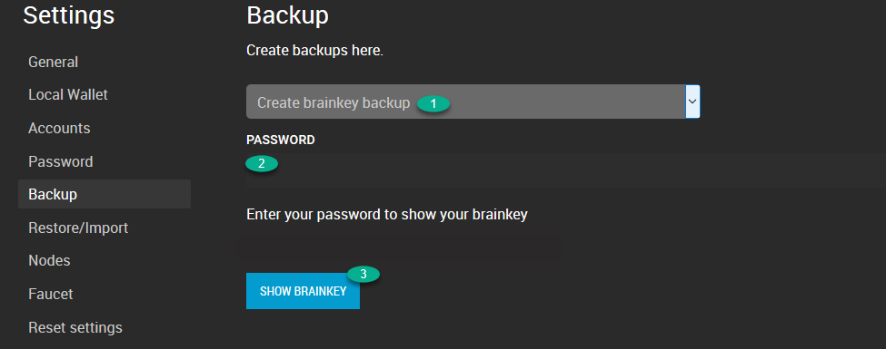
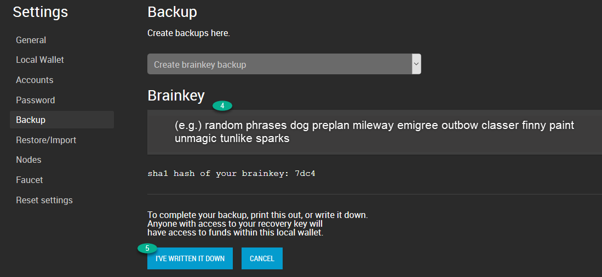
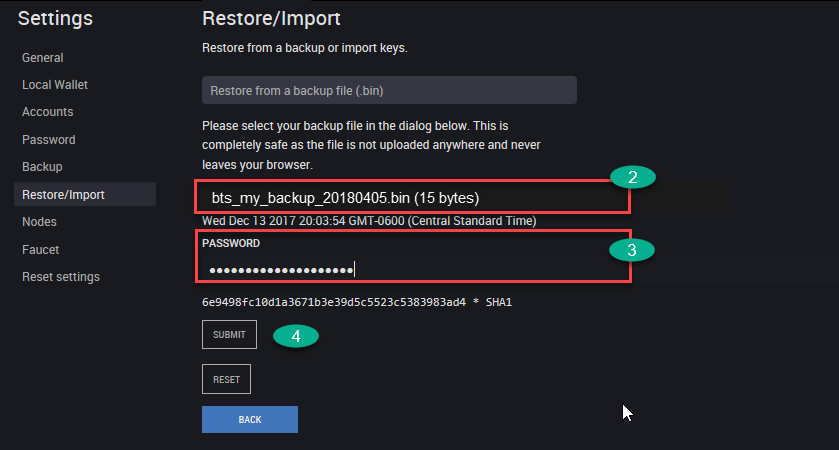
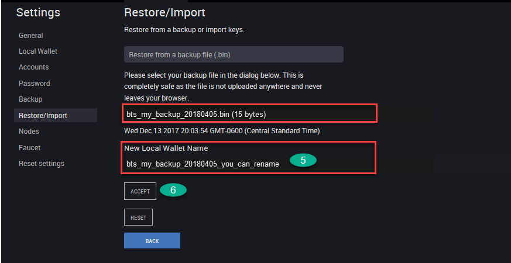
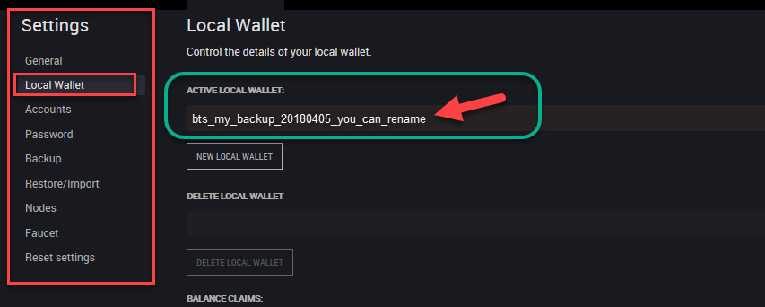
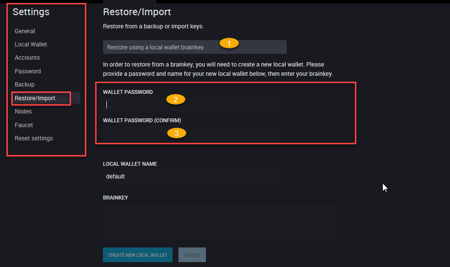
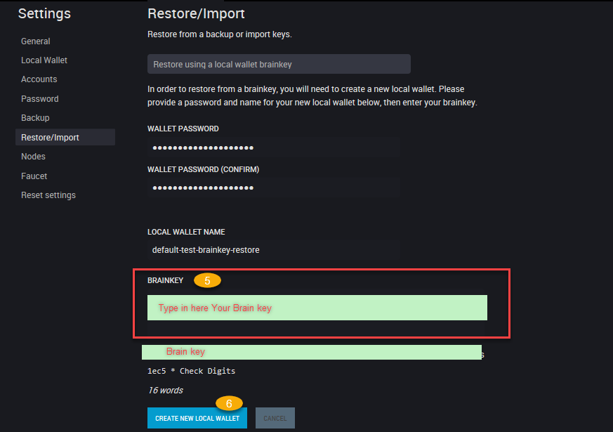
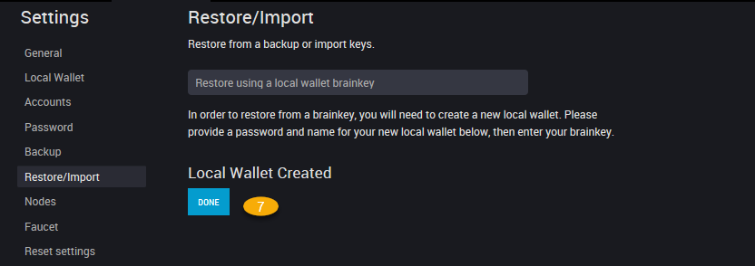

# Backups and Restore your Wallet

::: {.contents}
Table of Contents
:::

------------------------------------------------------------------------

\> If you use a Cloud Wallet, you do not need to create a backup. **You
do not have the option also.**

## Create Local Wallet Backup

It is recommended to make regular backups of your Local wallet. Please
note that in order to recover from a backup you will also need to
provide the passphrase (password) because backups are encrypted. If you
lose your wallet backup file or your passphrase, you will not be able to
access any of your funds again.

You are the only individual that has access to your account and funds,
it is your responsibility to make a secure backup of your registered
Local wallet account.

### Backup Types

There are three types of backups.

| type                       |                                                       |
|----------------------------|-------------------------------------------------------|
| Create local wallet backup | create a Binary File (.bin)                           |
| Create brainkey backup     | give you long random phrases. You need to write down. |
| Create favorites backup    |                                                       |

### How to Create a backup (.bin) file {#how-to-create-a-backup-.bin-file}

1.  Open a Side menu and select \[**Settings**\]
2.  In \[**Settings**\], select \[**Backup**\].
3.  Make sure the backup type is *Create local wallet backup*
4.  Click \[**CREATE BACKUP NOW**\]
5.  Check your backup file name (e.g. bts_somrthing_20180420.bin)
6.  Click \[**DOWNLOAD**\]

**Store this backup in at least two secure locations only accessible by
you**

{.align-center width="550px"}

{.align-center width="550px"}

### About the Brain Key

The brain key is used as source for all cryptographic keys generated in
the wallet. If you have it secured, you will be able to regain access to
your accounts and funds (unless the access keys have been changed)

### How to Create a Brainkey backup (Advanced User Only)

1.  Open a Side menu and select \[**Settings**\]
2.  In \[**Settings**\], select \[**Backup**\].
3.  (#1) Make sure the backup type is *Create brainkey backup*
4.  (#2) Type in a password
5.  (#3) Click \[**SHOW BRAINKEY**\]
6.  (#4) Write down *Brainkey* (i.g. very random long phrases)
7.  (#5) Click \[**I\'VE WRITTEN IT DOWN**\]

**Write it down!! Anyone with access to your recovery key will have
access to funds with in the local wallet.**

{.align-center width="650px"}

{.align-center
width="650px"}

------------------------------------------------------------------------

## Restore / Import {#restore-import}

> We assume you have created a backup file (.bin) and use a Local
> wallet.

### Restore / Import Options {#restore-import-options}

| option                                      |                                                                                                                                                                 |
|---------------------------------------------|-----------------------------------------------------------------------------------------------------------------------------------------------------------------|
| Restore from a backup file (.bin)           | restore from a backup file and a password                                                                                                                       |
| Import a private key                        | import Private keys to a Local wallet. The imported keys will be saved in the bin file. If this happens, you cannot rely on the brainkey for backup after that. |
| Import a BTS 0.9.3c key export file (.json) |                                                                                                                                                                 |
| Restore using a local wallet brainkey       | use a password and a Brain key                                                                                                                                  |
| Restore favorites using a json file         |                                                                                                                                                                 |

### How to Restore from a backup (.bin) file {#how-to-restore-from-a-backup-.bin-file}

1.  Open a Side menu and select \[**Settings**\]
2.  In \[**Settings**\], select \[**Restore/Import**\].
3.  (#1) Make sure you selected *Restore from a backup file (.bin)*
4.  (#2) Click \[**Browse\...**\] to find a backup file.

{.align-center width="650px"}

{.align-center width="650px"}

5.  (#3) Type in a password
6.  (#4) Click \[**SUBMIT**\]

{.align-center width="650px"}

7.  (#5) Type in *New Local Wallet Name* if you want to change the
    backup file name.
8.  (#6) Click \[**ACCEPT**\]
9.  (#7) **Ready to Restore** - below \"RESTORE(\..... WALLET)\" is a
    button. Click it.
10. You will find \"Successfully restored (\....)wallet. Done!!
11. (#8) Click \[**DASHBOARD**\]

{.align-center width="650px"}

{.align-center width="650px"}

### How to Check Active Local Wallet backup file name

- \[**Settings**\] - \[**Local Wallet**\] - Active Local Wallet

{.align-center width="650px"}

### How to Recover Account with Brain key

1.  Open a Side menu and select \[**Settings**\]
2.  In \[**Settings**\], select \[**Restore/Import**\].
3.  (#1) Make sure you selected *Restore using a local wallet brainkey*
4.  (#2) Type in a password
5.  (#3) Type in a password (Confirm)

{.align-center width="650px"}

6.  (#4) Type in new *Local Wallet Name* if needed. (e.g.
    \"default-test-brainkey-restore\")

{.align-center width="650px"}

{.align-center width="650px"}

7.  (#5) Type in **BRAINKEY**
8.  (#6) Click \[CREATE NEW LOCAL WALLET\]

{.align-center width="650px"}

9.  (#7) Click \[DONE\]
10. (#8) Let\'s check *ACTIVE LOCAL WALLET* name (Go to \[Settings\] -
    \[Local Wallet\])

{.align-center width="650px"}
