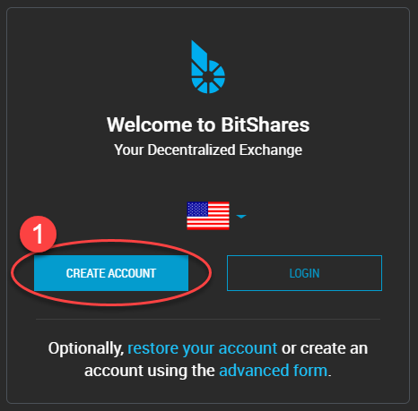
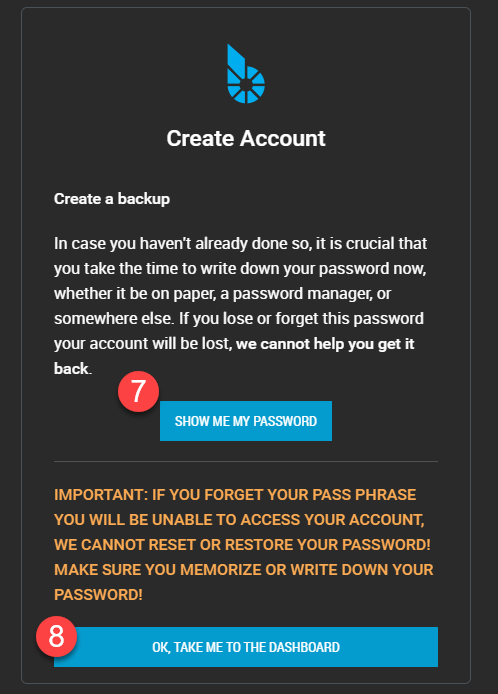
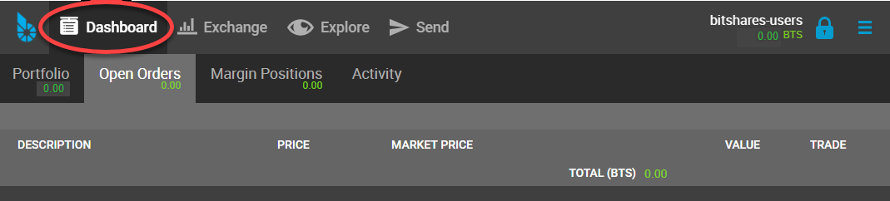
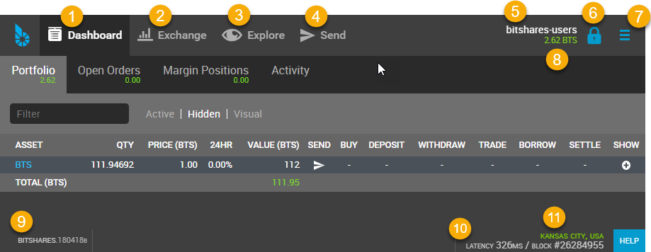
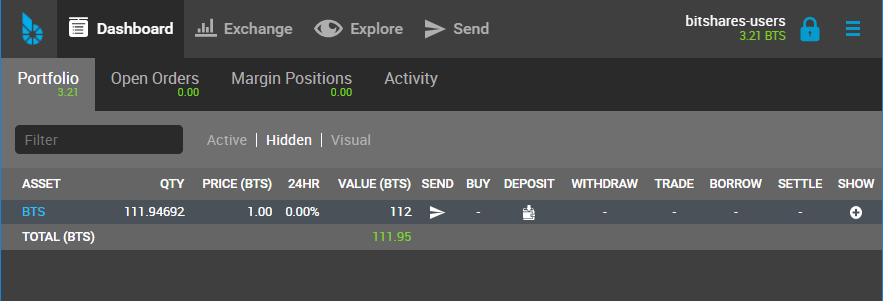
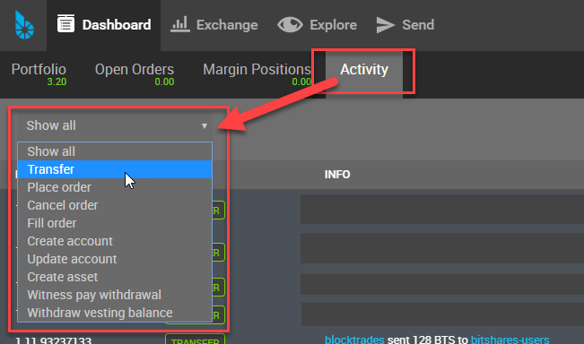

# Create a BitShares Wallet

::: {.contents}
Table of Contents
:::

------------------------------------------------------------------------

## Terminology

In this section, we want to describe Terminologies and guide you to
create and register your BitShares Account.

**Wallet**

Wallets interacts with the blockchain to process accounts and funds
functionalities. Users register to create a single wallet. The single
wallet can carry many accounts. Users who have a lifetime membership
(LTM) can register multiple accounts in parallel; all of them are stored
in a single wallet. Also, users can create multiple wallets to organize
their accounts properly.

**Accounts**

In BitShares, you can create own **unique account name**, so, you can
remember easily. And you will use the account name to communicate (e.g.
Send fund) with other BitShares account users (BTS Holders) like an
email address. The advantage of using account name is that people can
identify you by using a readable and memorable word instead of
cryptographic addresses.

Each user has at least one account that can be used to interact with the
blockchain. The account can be seen as a single banking account with an
individual balance, transaction history, etc. Since these accounts are
registered on the blockchain and are open to the public, we recommend to
pick a pseudonym to achieve some privacy.

**Keys**

Keys refer to the cryptography used to secure access to your account and
funds. It is of importance to prevent others from gaining access to
these keys.

BitShares has *owner, active and memo keys*. And each key has *public
key and private key*. It\'s important to know that Owner permission has
administrative powers over the whole account. Active Permission is
considered as an "online" permission that allows to access funds and
some account settings.

------------------------------------------------------------------------

## Light wallet or Web wallet?

Before we create a wallet, let\'s check what type of wallet you can have
as your BitShares wallet. Quick check the below chart.

{.align-center
width="550px"}

Did you find out which type of wallet you want to have?

- 

  If you want to install **Light Wallet (BitShares UI)**, download [BitShares UI Releases](https://github.com/bitshares/bitshares-ui/releases) file and install it to your machine.

  :   - *This does not mean you will have a Local wallet.*

- If you want to use **Web Wallet**, go to this link
  (<https://wallet.bitshares.org>).

------------------------------------------------------------------------

## Create an Account

In this section, you will create a **Cloud wallet**.

We use the term Cloud Wallet, but technically nothing is stored in the
cloud. We call the Cloud Wallet because **you can use your credentials
(username and password) from any web browser** at any time to gain
access to your account.

**Welcome BitShares - Create Account & Login form**

{.align-center
width="300px"}

### Steps

- 1.Click \[**CREATE ACCOUNT**\]
- 2.Type in \[**ACCOUNT NAME**\]. You can create your unique BitShares
  account name.
- 3.Set a password. Copy and use a **GENERATED PASSWORD**
- 4.Type or paste your password to confirm.
- 5.Check the check boxes. **Make sure you read before you check!**
- 6.Click \[**CREATE ACCOUNT**\]

{.align-center width="350px"}

Before you submit, check your password one more time if you saved the
correct one.

**ONLY you can open your wallet again. No one can help.** Do not lose
it!

- 7.Click **\[SHOW ME MY PASSWORD**\] and double check if you have a
  correct password.
- 8.Click \[**OK,TAKE ME TO THE DASHBOARD**\]

{.align-center width="350px"}

- Click the top menu \[**Dashbord**\] if it did not open.

{.align-center width="600px"}

Now, you have a BitShares **Cloud Wallet**. Before you fund to your
account, let\'s login to make sure if you have a correct password.

------------------------------------------------------------------------

## Login

Click a **Locked Key** icon in the top right corner to open a login
form.

{.align-center width="550px"}

### Cloud Wallet Login form

If you followed the above steps to create a BitShares account, you have
a Cloud Wallet as a default wallet.

On the Login form, you can see which wallet Login form for. (i.e., Login
with: Account name (cloud wallet))

{.align-center
width="400px"}

If you logged in successfully, you would find a **Unlocked Key**.

{.align-center width="600px"}

------------------------------------------------------------------------

## Advanced: Create an Account

In this section, you will create a **Local Wallet**.

If you have a Cloud Wallet, you can access your wallet from any
browsers. However, the Local Wallet, you can only access your funds from
**the same computer and web browser** that you have used to register and
create your account.

The Local wallet requires you to create **a backup file** to manage your
account and funds. The backup file can be used to move

{.align-center width="300px"}

### Steps

- 1.Click \[**advanced form**\]
- 2.Type in \[**ACCOUNT NAME**\]. You can create your unique BitShares
  account name.
- 3.Set a password. Create own strong password.
- 4.Type or paste your password to confirm.
- 5.Click \[**CREATE ACCOUNT**\]

\> **If this is yore first account, a faucet will pay the registration
fee for you!**

{.align-center width="300px"}

\> **Your Web Browser is your Wallet:** Please read the information
below.

{.align-center width="300px"}

- Click \[**CREATE BACKUP NOW**\]

{.align-center width="300px"}

**It\'s extremely important you to create a backup of your account and
keep a safe place**.

- Click \[**DOWNLOAD**\] to save a backup (.bin) file.

{.align-center width="300px"}

**Congratulation, you\'re ready!**

{.align-center width="300px"}

------------------------------------------------------------------------

## BitShares Wallet Features

### Quick Review Wallet Options

{.align-center width="650px"}

<table style="width:99%;">
<colgroup>
<col style="width: 3%" />
<col style="width: 18%" />
<col style="width: 77%" />
</colgroup>
<thead>
<tr class="header">
<th></th>
<th>Item name</th>
<th><blockquote>

note

</blockquote></th>
</tr>
</thead>
<tbody>
<tr class="odd">
<td>1</td>
<td>Dashboard</td>
<td>The Wallet Portfolio, Open Orders, Margin Positions, and Activity
information</td>
</tr>
<tr class="even">
<td>2</td>
<td>Exchange</td>
<td>BitShares Exchange, Trading information</td>
</tr>
<tr class="odd">
<td>3</td>
<td>Explore</td>
<td>BitShares Live Blockchain, Assets, Accounts, Witnesses members,
Committee members, Markets, and Fee Schedule</td>
</tr>
<tr class="even">
<td>4</td>
<td>Send</td>
<td>Opens a Send form. You can send funds to other BitShares Account
Holders</td>
</tr>
<tr class="odd">
<td>5</td>
<td>A BitShares account name</td>
<td>A account name that the data shows on a Dashboard page</td>
</tr>
<tr class="even">
<td>6</td>
<td>Key icon</td>
<td>By click, opens a login form. Locked/Unlocked Key icon shows if
you've logged in the account currently</td>
</tr>
<tr class="odd">
<td>7</td>
<td>Side Menu icon</td>
<td>Side Menu icon opens the wallet other menus in a dropdown list</td>
</tr>
<tr class="even">
<td>8</td>
<td>Asset Total</td>
<td>Currently showing in a Dashboard Total Assets</td>
</tr>
<tr class="odd">
<td>9</td>
<td>BitShares Wallet Version</td>
<td>The Release Version of BitShares UI Wallet</td>
</tr>
<tr class="even">
<td>10</td>
<td>Latency</td>
<td>The delay of Network connection</td>
</tr>
<tr class="odd">
<td>11</td>
<td>Server Node name</td>
<td>A server node name that you are connecting</td>
</tr>
</tbody>
</table>

#### Dashboard

{.align-center width="650px"}

**Dashboard Tabs**

<table>
<colgroup>
<col style="width: 16%" />
<col style="width: 83%" />
</colgroup>
<thead>
<tr class="header">
<th><blockquote>

Tab name

</blockquote></th>
<th><blockquote>

note

</blockquote></th>
</tr>
</thead>
<tbody>
<tr class="odd">
<td>Portfolio</td>
<td>Your Assets list. You can filter the assets and hide some assets if
you don't need to watch.</td>
</tr>
<tr class="even">
<td>Open Orders</td>
<td></td>
</tr>
<tr class="odd">
<td>Margin Positions</td>
<td></td>
</tr>
<tr class="even">
<td>Activity</td>
<td>Show your all transactions. (i.e., The below shows a type of
transactions to choose from.)</td>
</tr>
</tbody>
</table>

**Activity - Filters**

{.align-center
width="450px"}

#### Side Menus - Dropdown items

<table>
<colgroup>
<col style="width: 16%" />
<col style="width: 83%" />
</colgroup>
<thead>
<tr class="header">
<th><blockquote>

option

</blockquote></th>
<th></th>
</tr>
</thead>
<tbody>
<tr class="odd">
<td>login</td>
<td>By click, opens a login form.</td>
</tr>
<tr class="even">
<td rowspan="2">Create Account</td>
<td>Users who have a lifetime membership (LTM) can register multiple
accounts in parallel;</td>
</tr>
<tr class="odd">
<td>all of them are stored in a single wallet</td>
</tr>
<tr class="even">
<td>Send(legacy)</td>
<td>Transfer details (Original page). <strong>Send</strong> on the top
menu is new form.</td>
</tr>
<tr class="odd">
<td>Deposit</td>
<td>Deposit funds from other parties (Original Deposit page)</td>
</tr>
<tr class="even">
<td>Deposit(beta)</td>
<td>Select an asset you want to deposit and provide you a sending
address, Gateway, identicon, and notes.</td>
</tr>
<tr class="odd">
<td>Withdraw</td>
<td><blockquote>

(Original Withdraw page)

</blockquote></td>
</tr>
<tr class="even">
<td>Withdraw(beta)</td>
<td>Search an asset to withdraw</td>
</tr>
<tr class="odd">
<td rowspan="6">Settings</td>
<td>You can manage your wallet appearance and other settings.</td>
</tr>
<tr class="even">
<td rowspan="2">Settings - CLOUD Wallet Login Mode:</td>
</tr>
<tr class="odd">
</tr>
<tr class="even">
<td><ul>
<li>General</li>
<li>Accounts</li>
<li>Restore/Import</li>
<li>Nodes</li>
<li>Faucet</li>
<li>Reset settings</li>
</ul></td>
</tr>
<tr class="odd">
<td>Settings - LOCAL Wallet Login Mode:</td>
</tr>
<tr class="even">
<td><ul>
<li>General</li>
<li>Local Wallet</li>
<li>Accounts</li>
<li>Password</li>
<li>Backup</li>
<li>Restore/Import</li>
<li>Access</li>
<li>Faucet</li>
</ul></td>
</tr>
<tr class="odd">
<td>News</td>
<td>BitShares Blockchain Foundation and other News</td>
</tr>
<tr class="even">
<td>Help</td>
<td>Open a Help page</td>
</tr>
<tr class="odd">
<td rowspan="3">Voting</td>
<td>You can vote for Witnesses, Committee or Workers. Or you can set a
Proxy to case a vote.</td>
</tr>
<tr class="even">
<td>Voting is important: in Bitshares in the same way it is important to
the community in which you live. The weight of your vote is directly
correlated to the number of BTS you own.</td>
</tr>
<tr class="odd">
<td>If you aren't heavily involved in the community, you are encouraged
to choose a proxy who represents your interests.</td>
</tr>
<tr class="even">
<td>Asset</td>
<td><blockquote>

Issued Assets

</blockquote></td>
</tr>
<tr class="odd">
<td>Signed Message</td>
<td></td>
</tr>
<tr class="even">
<td>Membership stats</td>
<td>Basic Member is a default membership. You can upgrade to Lifetime
Membership here.</td>
</tr>
<tr class="odd">
<td rowspan="2">Vesting balances</td>
<td>Vesting balances contain any fees earned through the referral
program or from worker pay,</td>
</tr>
<tr class="even">
<td>For example. They have a tain vesting period and are continually
unlocked during that vesting period until all of the balances are
available</td>
</tr>
<tr class="odd">
<td>Whitelist</td>
<td>You can set Whitelist and/or Blicklist. Also, you can view
'Whitelisted by' and 'Blacklisted by'.</td>
</tr>
<tr class="even">
<td rowspan="3">Permissions</td>
<td>You can review/renew each account’s (Active, Owner, and Memo) Public
keys and Private keys information.</td>
</tr>
<tr class="odd">
<td>Active Permission: It’s consider to be the “online” permission.
control accessing funds and some account settings.</td>
</tr>
<tr class="even">
<td>Owner Permission: This permission has administrative power over the
account Also, if you want to change your Cloud Wallet password, use the
“Cloud Wallet” tab page.</td>
</tr>
<tr class="odd">
<td>(Accounts)</td>
<td></td>
</tr>
</tbody>
</table>
