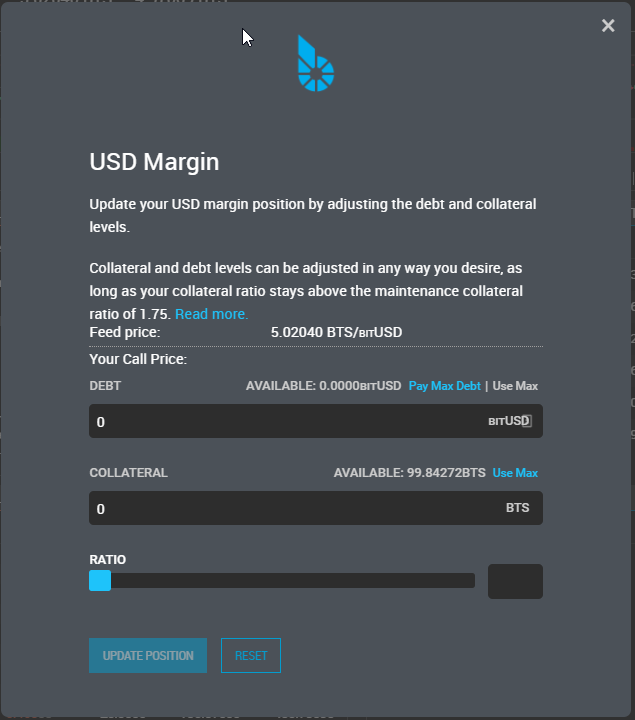
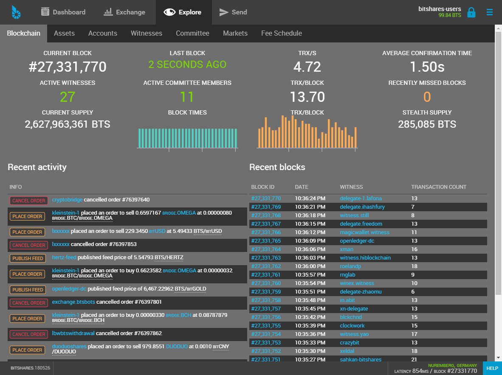
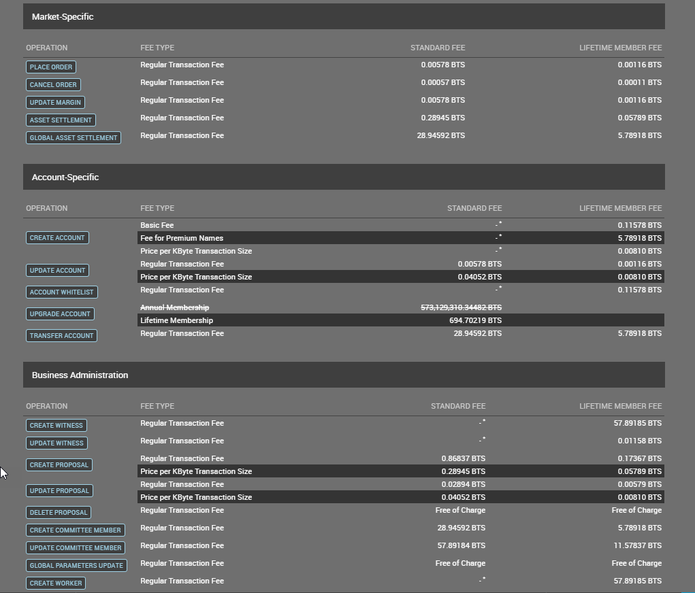
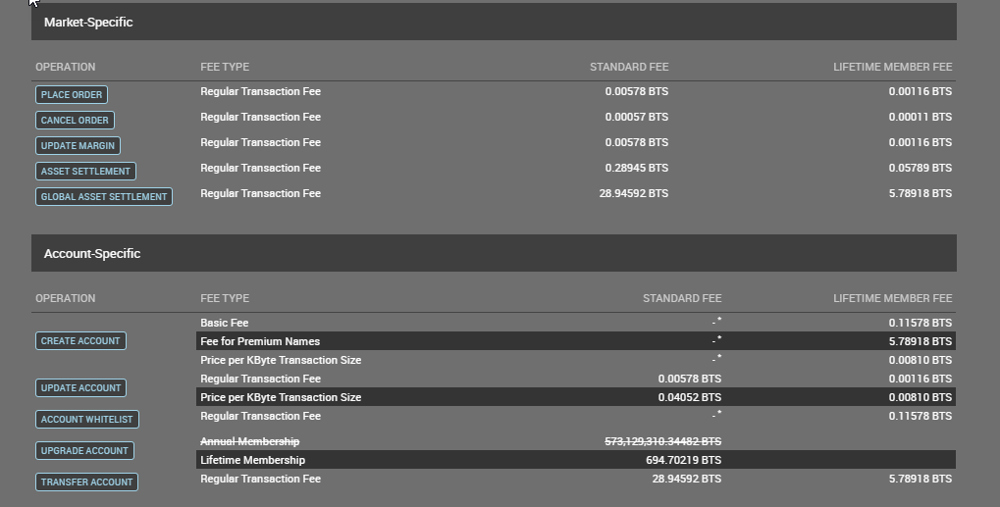

# Exchange and Explore

::: {.contents}
Table of Contents
:::

------------------------------------------------------------------------

## Exchange

<https://wallet.bitshares.org/#/market/USD_BTS>

{.align-center width="600px"}

### Form Features

{.align-center width="600px"}

{.align-center width="600px"}

## How to trade in the DEX

The decentralized exchange (DEX) of BitShares has a similar look&feel as
traditional centralized exchanges. However, trading in the DEX can have
many different appearances, depending on what user-interface is used. We
here describe the user interface of the official wallet.

### Playing Orders

Orders can be placed in the same way as everywhere else, by providing

- the amount to buy/sell
- the price at which to buy/sell

{.align-center width="600px"}

{.align-center width="300px"}

{.align-center
width="300px"}

#### Fees

In contrast to other exchanges, BitShares asks for a tiny **flat fee**
for placing an order. This fee can be payed in USD, BTC, or GOLD and is
independent of the actual assets that are traded.

If you cancel an order that has not been fully or partially filled, 90%
of the fee will be payed back to your account. However, this chargeback
will be in [BTS]{.title-ref} and not in the asset you have originally
paid the fee in.

## Explore

> (*Forms layouts*)

{.align-center width="600px"}

{.align-center
width="600px"}

{.align-center
width="600px"}

{.align-center
width="600px"}

{.align-center
width="600px"}

{.align-center
width="600px"}

{.align-center
width="600px"}
