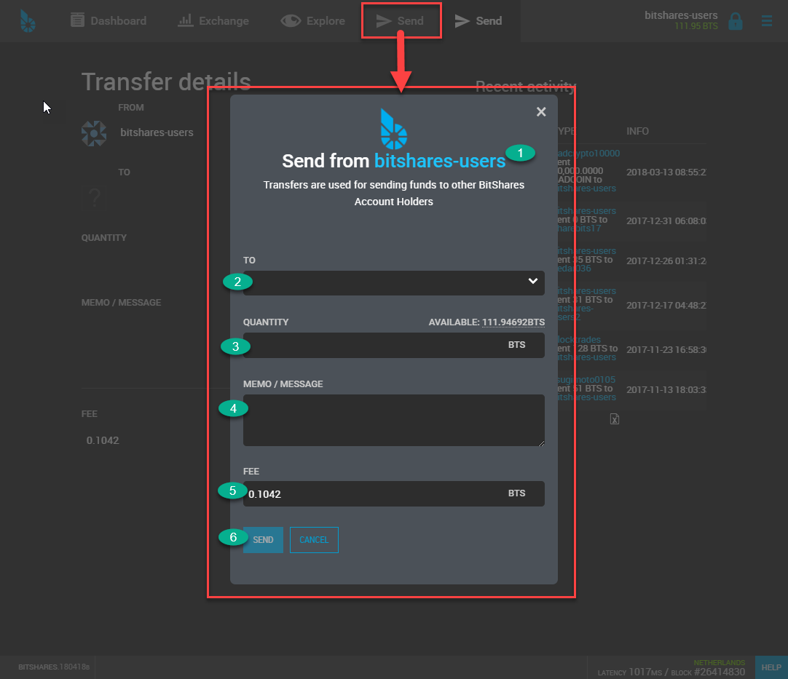
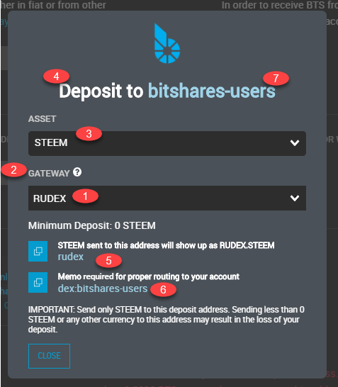
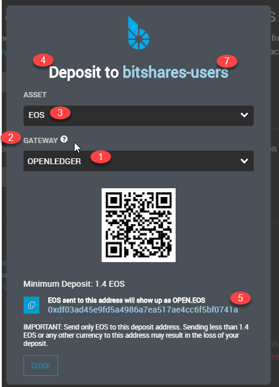
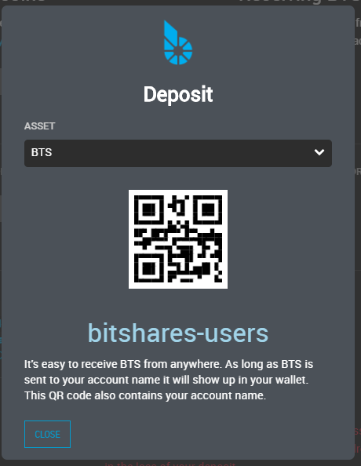
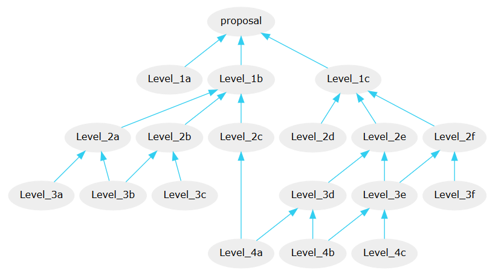

# Fund (Send) & Transactions {#fund-send-transactions}

::: {.contents}
Table of Contents
:::

------------------------------------------------------------------------

## Fund your Account

### Two Options to Fund your Account

- **Send (Transfer)**: This is for between BitShares account holders to
  send funds. On the BitShares Blockchain , people never need to deal
  with *addresses* or *public keys*. BitShares account holders can use
  their *account names* for communication.
- **Deposits**: BitShares account holders can use one of our partners to
  move over existing funds into your BitShares account.

## Send (Transfer)

Currently, there are two forms to send funds. One is **Send** on the top
menu. Another one is **Send (legacy)** on the side menu. Both work the
same.

First, we want to list what information on the Send form. Next, you can
check each item in the Send form images.

### Send Forms items and descriptions

<table style="width:99%;">
<colgroup>
<col style="width: 3%" />
<col style="width: 27%" />
<col style="width: 68%" />
</colgroup>
<thead>
<tr class="header">
<th></th>
<th><blockquote>

Item

</blockquote></th>
<th><blockquote>

Description

</blockquote></th>
</tr>
</thead>
<tbody>
<tr class="odd">
<td>1</td>
<td>Sender's BitShares Account name</td>
<td>This would be your BitShares Account Name (e.g.
<em>bitshares-users</em>)</td>
</tr>
<tr class="even">
<td>2</td>
<td>TO</td>
<td>Another BitShares Account name whom you want to send funds</td>
</tr>
<tr class="odd">
<td rowspan="2">3</td>
<td rowspan="2">QUANTITY</td>
<td><ul>
<li>This is a dropdown list and will show all assets you have in the
wallet account.</li>
</ul></td>
</tr>
<tr class="even">
<td><ul>
<li>Type in a sending amount - AVAILABLE: a selected asset available
total amounts</li>
</ul></td>
</tr>
<tr class="odd">
<td>4</td>
<td>MEMO/MESSAGE</td>
<td>(option)</td>
</tr>
<tr class="even">
<td>5</td>
<td>FEE</td>
<td>Transaction fee you pay</td>
</tr>
<tr class="odd">
<td>6</td>
<td>SEND</td>
<td>(button)</td>
</tr>
<tr class="even">
<td>7</td>
<td>PASSWORD</td>
<td>If you have not logged in to the wallet, you will be asked to
login</td>
</tr>
<tr class="odd">
<td>8</td>
<td>LOGIN</td>
<td>(button)</td>
</tr>
<tr class="even">
<td>9</td>
<td>CONFIRM</td>
<td>(button) last check before you send founds</td>
</tr>
</tbody>
</table>

### Form: Send

A send (transfer) operation moves funds from user `A` to user `B`. In
contrast to most other blockchain-based financial networks, we do
**not** use *addresses* or *public keys* for transfers.

Instead, all that is needed for transfers is:

- source account name: From
- destination account name: To
- funds (amount and asset): Quantity
- asset/token type
- memo (optional)

A transfer may contain a memo with arbitrary text.

> [!NOTE]
> The `memo` is **encrypted** by default can only be decrypted by the
> participants of the transfer! The transfer fee depends on the length
> of the memo!

{.align-center width="650px"}

\> After click \[SEND\], you need to login (if it\'s not yet) and
\[CONFIRM\] the Transaction.

**Form: Send - Transfer details (legacy form)**

{.align-center width="650px"}

## Deposit

Currently, there are two forms to deposit funds. One is **Deposit** and
another one is **Deposit (Beta)**. Both locate on the side menu.

BitShares has partners to provide Transfer (i.g. Gateway/Bridge)
services which you can choose from. Each Transfer service has own
instruction and available coins to handle. When you select a Transfer
Service, please follow the instruction. In the next section, we will
show you several examples and patterns to compare the deposit forms.

> [!NOTE]
> On the BitShares blockchain, people never need to deal with
> *addresses* or *public keys* but can instead use account names. Your
> account name becomes the *email address* for your funds.

### Deposit Forms Items and Descriptions

<table style="width:99%;">
<colgroup>
<col style="width: 3%" />
<col style="width: 22%" />
<col style="width: 73%" />
</colgroup>
<thead>
<tr class="header">
<th></th>
<th><blockquote>

Item

</blockquote></th>
<th><blockquote>

Description

</blockquote></th>
</tr>
</thead>
<tbody>
<tr class="odd">
<td>1</td>
<td>Transfer Service</td>
<td>A dropdown list - Select a transfer service</td>
</tr>
<tr class="even">
<td>2</td>
<td>Service Type</td>
<td>A service you use</td>
</tr>
<tr class="odd">
<td>3</td>
<td>Coin Name</td>
<td>A dropdown list - Select the coin name you want to deposit</td>
</tr>
<tr class="even">
<td>4</td>
<td>Deposit / Withdraw tabs</td>
<td>Select <em>Deposit</em> tab</td>
</tr>
<tr class="odd">
<td>5</td>
<td>Address</td>
<td>Your deposit address to transfer funds.</td>
</tr>
<tr class="even">
<td>6</td>
<td>Memo</td>
<td>Your Memo information to transfer funds. (<em>Not all coins'
transfers use `Memo`</em>)</td>
</tr>
<tr class="odd">
<td>7</td>
<td>BitShares Account Name</td>
<td>This would be your BitShares Account name</td>
</tr>
</tbody>
</table>

> If you cannot select an Asset on the Deposit(Beta) form, try to login
> to your wallet first.

#### Examples

**(Example 1) Deposit STEEM by using a Gateway service**

You use [ADDRESS]{.title-ref} and [MEMO]{.title-ref} to deposit funds.
The below images show a Deposit and a Deposit(Beta) forms.

{.align-center
width="650px"}

{.align-center width="350px"}

**(Example 2) Deposit EOS by using a Gateway service**

You use [ADDRESS]{.title-ref} to deposit funds. The below images show a
Deposit and a Deposit(Beta) forms.

{.align-center
width="650px"}

{.align-center width="300px"}

**(Example 3) Deposit BTS**

You use BitShares Account Name as [ADDRESS]{.title-ref} to deposit
funds. The below image shows a Deposit(Beta) form.

{.align-center width="300px"}

------------------------------------------------------------------------

## Transactions

### Proposed Transactions

The Graphene technology allows users to *propose* a transaction on the
blockchain which requires approval of multiple accounts in order to
execute.

At any time, a proposal can be approved in a single transaction if
sufficient signatures are available (see `proposal_update_operation` as
constructed by the `approve_proposal` call), as long as the authority
tree to approve the proposal does not exceed the maximum recursion
depth. In practice, however, it is easier to use proposals to acquire
all approvals, as this leverages on-chain notification of all relevant
parties that their approval is required. Off-chain multi-signature
approval requires some off-chain mechanism for acquiring several
signatures on a single transaction. This off-chain synchronization can
be avoided using proposals.

The user proposes a transaction, then signatory accounts use add or
remove their approvals from this operation. When a sufficient number of
approvals have been granted, the operations in the proposal are
evaluated. Even if the transaction fails, the proposal will be kept
until the expiration time, at which point, if sufficient approval is
granted, the transaction will be evaluated a final time. This allows
transactions which will not execute successfully until a given time to
still be executed through the proposal mechanism. The first time the
proposed transaction succeeds, the proposal will be regarded as
resolved, and all future updates will be invalid.

The proposal system allows for arbitrarily complex or recursively nested
authorities. If a recursive authority (i.e. an authority which requires
approval of \'nested\' authorities on other accounts) is required for a
proposal, then a second proposal can be used to grant the nested
authority\'s approval. That is, a second proposal can be created which,
when sufficiently approved, adds the approval of a nested authority to
the first proposal. This multiple-proposal scheme can be used to acquire
approval for an arbitrarily deep authority tree.

{.align-center
width="890px"}

Note that each account in the figure can carry a **different weight**.
An example of how to setup your permissions accordingly is given in
`account-permissions`{.interpreted-text role="ref"}.

### Confidential Transactions

A confidential transfer is one that hides the amount being sent.
Confidential transfers are also referred to as blinded transfers. It
makes use of Oleg Andreev\'s [blind
signatures](http://blog.oleganza.com/post/77474860538/blind-signatures).

When privacy is important no account is ever used twice and it is
impossible for any third party to identify how money is moving through
blockchain analysis alone.
