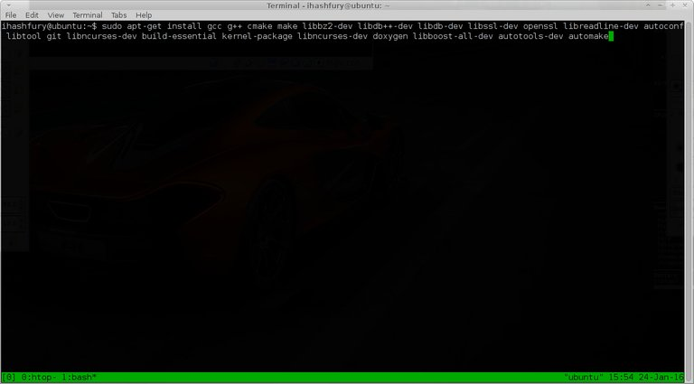
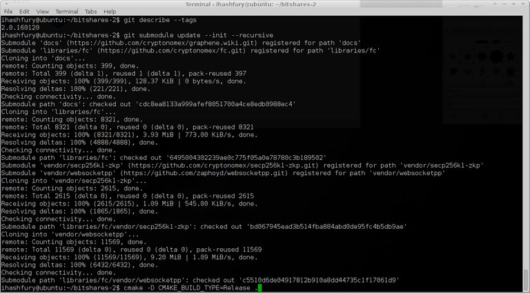
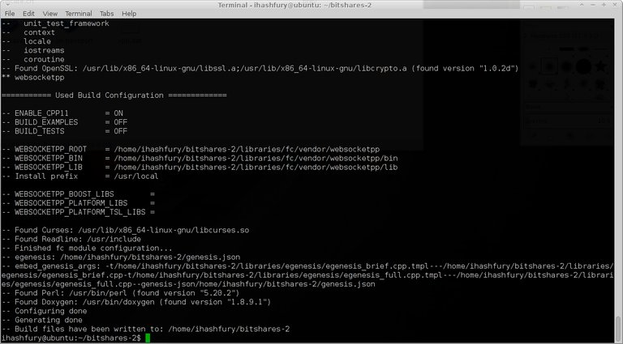
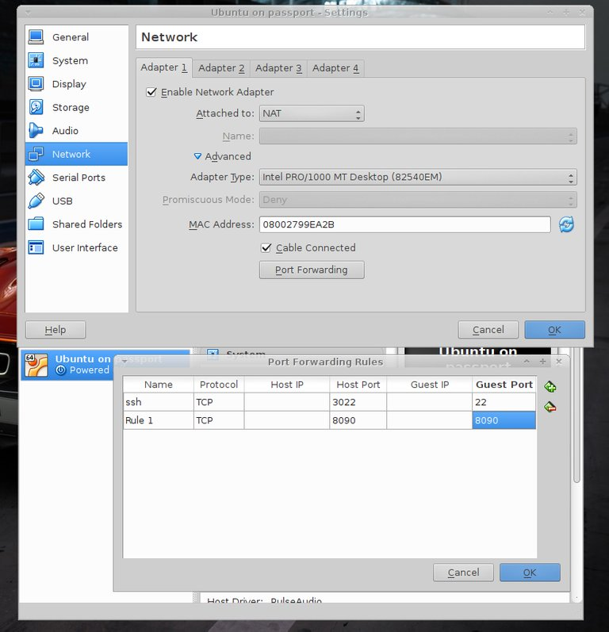
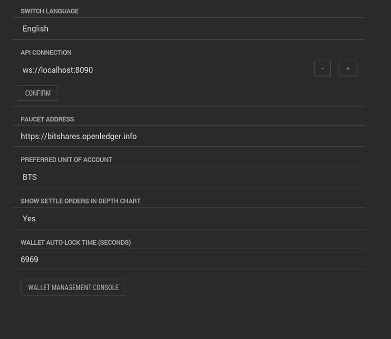
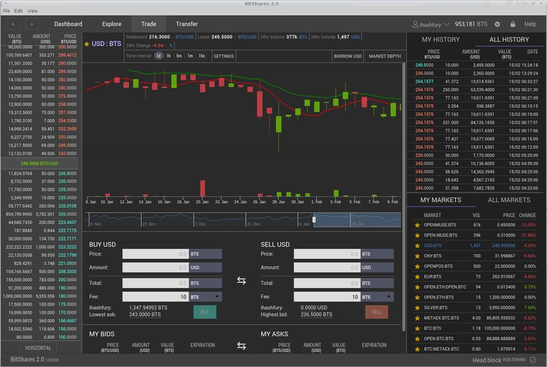
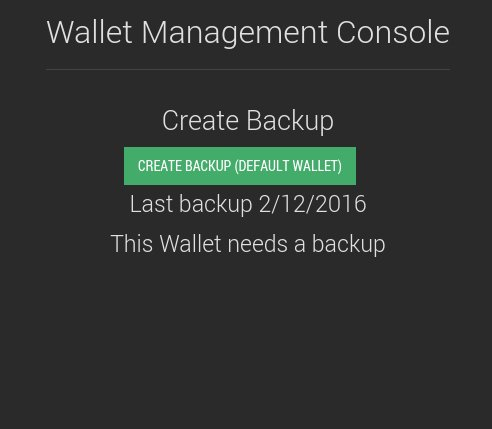
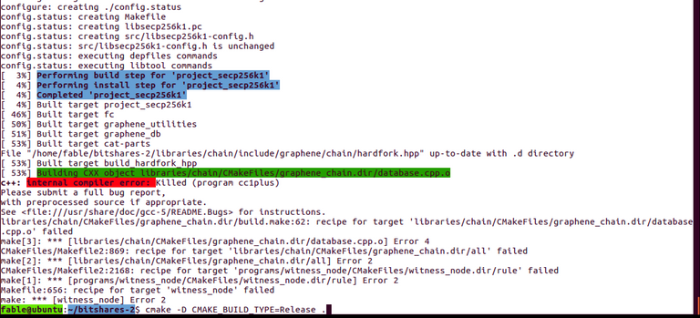

# Run your own decentralised exchange

**[ihashfury (56)](/@ihashfury)**in [#bitshares](/trending/bitshares) • 9 years ago (edited)
# You can now run your own decentralised exchange node and trade **STEEM** with:

**[#BTS](/trending/bts)  [#BTC](/trending/btc)  [#LTC](/trending/ltc)  [#DOGE](/trending/doge)  [#DASH](/trending/dash) PPC  [#ETH](/trending/eth) NXT  [#MUSE](/trending/muse) NSR NBT EMC EGH  [#GOLD](/trending/gold)  [#SILVER](/trending/silver)  [#USD](/trending/usd)  [#EUR](/trending/eur)  [#CNY](/trending/cny)  [#GBP](/trending/gbp) ...**

all using a Light Wallet with built-in deposit/withdraw and FIAT gateway.  

  

A few steps will have you up and running. The system uses a Light Wallet which can connect to trusted secure servers or your own local blockchain (run from the command line).

**P2P Decentralised Exchange Node setup for Ubuntu x64 - ( copy and paste to your terminal )  

You can run on your own computer, a local server, VPS or VirtualBox.**

```
### 1. Download the software to build for Ubuntu Linux x64 using git:

# update your system and install ntp
sudo apt-get update && sudo apt-get -y upgrade
sudo apt-get install ntp
sudo dpkg-reconfigure tzdata # to set your time zone

# Install the build tools
sudo apt-get install gcc g++ cmake make libbz2-dev libdb++-dev libdb-dev libssl-dev openssl libreadline-dev autoconf libtool git libncurses-dev build-essential kernel-package libncurses-dev doxygen libboost-all-dev autotools-dev automake

# you may have to run this on a fresh install and reboot
#sudo dpkg --configure -a
#sudo reboot

# download the P2P node software
git clone https://github.com/bitshares/bitshares-2.git

# build the P2P node software
cd bitshares-2
git checkout bitshares
git describe --tags
git submodule update --init --recursive
cmake -D CMAKE_BUILD_TYPE=Release .
make witness_node cli_wallet

```

  

  



```
### 2. Run your new P2P Decentralised Exchange Node

~/bitshares-2/programs/witness_node/witness_node --rpc-endpoint "127.0.0.1:8090" # will allow only your computer's wallet to connect to the blockchain
# ~/bitshares-2/programs/witness_node/witness_node --rpc-endpoint "0.0.0.0:8090" # will allow anyone to connect their wallet to your copy of the blockchain

# you can also strip and copy witness_node to your bin folder for easy blockchain startup

mkdir ~/bin
strip ./programs/witness_node/witness_node
strip ./programs/cli_wallet/cli_wallet
cp ./programs/witness_node/witness_node ~/bin
cp ./programs/cli_wallet/cli_wallet ~/bin

```


Check the block explorer for the latest block [https://cryptofresh.com/](https://cryptofresh.com/ "This link will take you away from hive.blog")

I have used [VirtualBox](https://www.virtualbox.org/ "This link will take you away from hive.blog") to run the blockchain on Ubuntu.

> Remember to install openssh and forward ports in VirtualBox host  
> 
> Network settings then ssh in (you can use putty on windoze).

```
# ssh user@127.0.0.1 -p 3022

```



**3. The fun part - download the Light Wallet software for your OS**

**Download the Light Wallet here:**  

[BitShares Light Wallet](https://bitshares.org/download/?r=by24seven "This link will take you away from hive.blog")

**Tutorial**  
[https://bitshares.org/register/](https://bitshares.org/register/ "This link will take you away from hive.blog")

Set your user name and password (if you found the post useful, you could add by24seven as your Referrer and get a few Free [PERKS](https://cryptofresh.com/a/PERKS "This link will take you away from hive.blog") too)

**Connect to your local chain after it has synchronised**  

In the Light Wallet under `settings * API CONNECTION` click on `wss://bitshares.openledger.info/ws` and change it to your own blockchain node from *part 2*

**linux**  

`ws://127.0.0.1:8090`  

or  

`ws://localhost:8090`

**VirtualBox linux**  

`ws://localhost:3022`

**or server ip**  

`ws://localserverip:8090`

Then click `CONFIRM`

> If you are using a VPS it is recommended you use ssh to connect to the API eg:  
> 
> `ssh -L 6080:localhost:8090 user@vpsserverip`  
> 
> then connect to the API with  
> 
> `ws://localhost:6080`  
> 
> in the Light Wallet



# Welcome to your own Decentralised Exchange



**More help can be found here:**  
  
[https://docs.bitshares.eu/](https://docs.bitshares.eu/ "This link will take you away from hive.blog")
[https://bitsharestalk.org/index.php/board,45.0.html](https://bitsharestalk.org/index.php/board,45.0.html "This link will take you away from hive.blog")

Enjoy!

> if you are lazy you can use these Decentralised Exchanges in your chromium browser! (no need to install software and a few Free [PERKS](https://cryptofresh.com/a/PERKS "This link will take you away from hive.blog") too)

[Bitshares](https://bitshares.org/wallet/?r=by24seven "This link will take you away from hive.blog")  

[OpenLedger](https://bitshares.openledger.info/?r=by24seven "This link will take you away from hive.blog")  

[DacPlay](https://bitshares.dacplay.org/?r=by24seven "This link will take you away from hive.blog")

# Remember to back-up your wallet, as only you have the private keys to access your funds to trade on all these Decentralised Exchanges.

  
[#bitcoin](/trending/bitcoin)  [#litecoin](/trending/litecoin)  [#gold](/trending/gold)  [#silver](/trending/silver)  [#steem](/trending/steem)

 [#gold](/trending/gold)  [#GOLD](/trending/GOLD)  [#EUR](/trending/EUR)  [#USD](/trending/USD)  [#DOGE](/trending/DOGE)  [#steem](/trending/steem)  [#sudo](/trending/sudo)  [#SILVER](/trending/SILVER)  [#silver](/trending/silver)  [#CNY](/trending/CNY)  [#BTC](/trending/BTC)  [#DASH](/trending/DASH)  [#GBP](/trending/GBP)  [#ETH](/trending/ETH)  [#MUSE](/trending/MUSE)  [#LTC](/trending/LTC)  [#bitcoin](/trending/bitcoin)  [#litecoin](/trending/litecoin) 9 years ago in [#bitshares](/trending/bitshares) by **[ihashfury (56)](/@ihashfury)**[$419.63](#)

* Past Payouts $419.63
* - Author $209.88
* - Curators $209.74
[34 votes](#)

* [blocktrades: $204.46](/@blocktrades)
* [berniesanders: $169.40](/@berniesanders)
* [fuzzyvest: $34.59](/@fuzzyvest)
* [pharesim: -$25.98](/@pharesim)
* [nextgencrypto: $17.98](/@nextgencrypto)
* [ihashfury: $5.96](/@ihashfury)
* [xeroc: $5.17](/@xeroc)
* [liondani: $2.99](/@liondani)
* [benjojo: $1.57](/@benjojo)
* [kimziv: $0.96](/@kimziv)
* [tuck-fheman: $0.90](/@tuck-fheman)
* [sandra: $0.74](/@sandra)
* [fminerten1: $0.23](/@fminerten1)
* [noisy: $0.20](/@noisy)
* [pheonike: $0.17](/@pheonike)
* [markopaasila: $0.06](/@markopaasila)
* [mostar: $0.06](/@mostar)
* [bangking: $0.04](/@bangking)
* [kewpiedoll: $0.04](/@kewpiedoll)
* [jabberw0cky: $0.04](/@jabberw0cky)
* and 14 more
Reply    [13](/bitshares/@ihashfury/run-your-own-decentralised-exchange "13 Responses")


Sort:- [Trending](#)
  * [Trending](/bitshares/@ihashfury/run-your-own-decentralised-exchange?sort=trending#comments)
  * [Votes](/bitshares/@ihashfury/run-your-own-decentralised-exchange?sort=votes#comments)
  * [Age](/bitshares/@ihashfury/run-your-own-decentralised-exchange?sort=new#comments)
[-]**[pharesim (73)](/@pharesim)** [9 years ago](/bitshares/@ihashfury/run-your-own-decentralised-exchange#@pharesim/re-ihashfury-run-your-own-decentralised-exchange-20160517t165506202z) (edited) 

"Remember to back-up your wallet, as only you have the private keys to access your funds to trade on all these Decentralised Exchanges."

This sentence shows exactly why I'm opposed to promoting trading OPEN.STEEM and advertising it as decentralized.  

Users don't have the convenience of password resets and 2FA, but still have to take all the risks of a centralized exchange (issuer getting hacked and funds stolen, or simply running away). What's the big plus that makes it so great? I cannot see it.

[$10.57](#)

* Past Payouts $10.57
* - Author $5.29
* - Curators $5.29
[4 votes](#)

* [fuzzyvest: $6.60](/@fuzzyvest)
* [pharesim: $4.96](/@pharesim)
* [ihashfury: -$0.99](/@ihashfury)
* [mostar: $0.00](/@mostar)
Reply   [-]**[ihashfury (56)](/@ihashfury)** [9 years ago](/bitshares/@ihashfury/run-your-own-decentralised-exchange#@ihashfury/re-pharesim-re-ihashfury-run-your-own-decentralised-exchange-20160517t165506202z-20160517t171126451z) (edited) 

I did not advertise OPEN.STEEM as decentralized - The exchange is decentralized.  

You can also set-up a STEEM SmartCoin if you want to trade a decentralized coin on a decentralized exchange.  

See [BTC](http://cryptofresh.com/a/BTC "This link will take you away from hive.blog") or [ALTCAP](http://cryptofresh.com/a/ALTCAP "This link will take you away from hive.blog") for an example.

[$0.36](#)

* Past Payouts $0.36
* - Author $0.18
* - Curators $0.18
[2 votes](#)

* [fuzzyvest: $2.36](/@fuzzyvest)
* [pharesim: -$2.00](/@pharesim)
Reply   [-]**[pharesim (73)](/@pharesim)** [9 years ago](/bitshares/@ihashfury/run-your-own-decentralised-exchange#@pharesim/re-ihashfury-re-pharesim-re-ihashfury-run-your-own-decentralised-exchange-20160517t165506202z-20160517t171126451z-20160517t172419349z) (edited) 

You said I could trade STEEM on a decentralized exchange, and that's just not true.

I'm not blaming you for using that term, because in BTS-land it just works like that. But: everyone else expects decentralized storage when talking about a decentralized exchange. An exchange without gateways is useless, and when it comes to decentralization the gateway is much more important than the trading backend. What exactly is the pro for the user when only the trading is decentralized?

IMO that's even one of the main reasons why BTS lacks success. If it delivered what everyone expected from a decentralized exchange it'd be a killer. With centralized gateways, it's unnecessary. NXT MGW is more decentralized than anything on BTS (yes, except SmartCoins, but that's another story).

[$10.46](#)

* Past Payouts $10.46
* - Author $5.23
* - Curators $5.23
[4 votes](#)

* [fuzzyvest: $6.57](/@fuzzyvest)
* [pharesim: $4.86](/@pharesim)
* [ihashfury: -$0.98](/@ihashfury)
* [mostar: $0.00](/@mostar)
Reply   [-]**[fuzzyvest (62)](/@fuzzyvest)** [9 years ago](/bitshares/@ihashfury/run-your-own-decentralised-exchange#@fuzzyvest/re-pharesim-re-ihashfury-re-pharesim-re-ihashfury-run-your-own-decentralised-exchange-20160517t165506202z-20160517t171126451z-20160517t172419349z-20160517t185955510z)  

This is 100% agreed imo. If Bitshares doesn't do this, someone else will. And then...where will Bitshares be?  

What do you think about IPFS and how should bitshares best fix this in your opinions?

On a positive endnote, however, I think there is one obvious benefit to bts today--- it significantly lowers the barrier to entry for running your own centralized exchange---*is* cool though :)

[$10.65](#)

* Past Payouts $10.65
* - Author $5.32
* - Curators $5.32
[4 votes](#)

* [fuzzyvest: $6.75](/@fuzzyvest)
* [pharesim: $4.90](/@pharesim)
* [ihashfury: -$1.01](/@ihashfury)
* [bob-the-poster: $0.00](/@bob-the-poster)
Reply   [-]**[ihashfury (56)](/@ihashfury)** [9 years ago](/bitshares/@ihashfury/run-your-own-decentralised-exchange#@ihashfury/re-ihashfury-run-your-own-decentralised-exchange-20160706t092355965z)  

[altcap.io](http://altcap.io/?r=by24seven "This link will take you away from hive.blog") please have a look at this post - [Distributed Access to the BitShares Decentralised Exchange](https://steemit.com/bitshares/@ihashfury/distributed-access-to-the-bitshares-decentralised-exchange "This link will take you away from hive.blog")If you would also like to provide a  [#backup](/trending/backup)  [#gateway](/trending/gateway) and  [#WebSocket](/trending/websocket) access to the  [#bitshares](/trending/bitshares) platform for bitshares  [#shareholders](/trending/shareholders) comparable to 

[$0.13](#)

* Past Payouts $0.13
* - Author $0.13
* - Curators $0.00
[3 votes](#)

* [ihashfury: $0.11](/@ihashfury)
* [sandra: $0.01](/@sandra)
* [jason: $0.01](/@jason)
Reply   [-]**[brigon (45)](/@brigon)** [9 years ago](/bitshares/@ihashfury/run-your-own-decentralised-exchange#@brigon/re-ihashfury-run-your-own-decentralised-exchange-20160707t152522536z)  

hi, great post. I am busy setting up on azure vm.

[$0.09](#)

* Past Payouts $0.09
* - Author $0.07
* - Curators $0.02
[2 votes](#)

* [ihashfury: $0.08](/@ihashfury)
* [sandra: $0.01](/@sandra)
Reply   [-]**[ihashfury (56)](/@ihashfury)** [9 years ago](/bitshares/@ihashfury/run-your-own-decentralised-exchange#@ihashfury/re-brigon-re-ihashfury-run-your-own-decentralised-exchange-20160708t113032166z)  

Thanks  

If you need any help please post here and/or join [Bitshares Telegram Chat](https://telegram.me/joinchat/BYoMpwH95HL-crZbLpMiAA "This link will take you away from hive.blog")

$0.00

[1 vote](#)

* [sandra](/@sandra)
Reply   [-]**[brigon (45)](/@brigon)** [9 years ago](/bitshares/@ihashfury/run-your-own-decentralised-exchange#@brigon/re-ihashfury-re-brigon-re-ihashfury-run-your-own-decentralised-exchange-20160708t140025709z)  

Had some issues with some packages: boost, flex, bison, but seems errors are ok now! might contact you still for some help!

$0.00

Reply   [-]**[brigon (45)](/@brigon)** [9 years ago](/bitshares/@ihashfury/run-your-own-decentralised-exchange#@brigon/re-brigon-re-ihashfury-re-brigon-re-ihashfury-run-your-own-decentralised-exchange-20160710t191805217z) (edited) 

btw, which linux version would be best to use? ubuntu? version? 12.04 or 15.10 or latest? what server would be best, cores and memory?

$0.00

Reply   [-]**[djleo (54)](/@djleo)** [9 years ago](/bitshares/@ihashfury/run-your-own-decentralised-exchange#@djleo/re-ihashfury-run-your-own-decentralised-exchange-20160709t011941099z)  

Looks interesting! Are there any plans to support Monero too?

[$0.08](#)

* Past Payouts $0.08
* - Author $0.06
* - Curators $0.02
[1 vote](#)

* [ihashfury: $0.08](/@ihashfury)
Reply   [-]**[crispywhips93 (32)](/@crispywhips93)** [7 years ago](/bitshares/@ihashfury/run-your-own-decentralised-exchange#@crispywhips93/re-ihashfury-run-your-own-decentralised-exchange-20171021t110422320z)  

I need to upgrade my server capacity I want to run a node from my home

[$0.02](#)

* Past Payouts $0.02
* - Author $0.02
* - Curators $0.00
[1 vote](#)

* [crispywhips93: $0.02](/@crispywhips93)
Reply   [-]**[tatchcapital (47)](/@tatchcapital)** [7 years ago](/bitshares/@ihashfury/run-your-own-decentralised-exchange#@tatchcapital/re-ihashfury-run-your-own-decentralised-exchange-20171219t193017504z)  

Hello,

Post date a bit; but it's still the best tuto I have founded.  

However I'm stuck at step 1

$0.00

[1 vote](#)

* [tatchcapital](/@tatchcapital)
Reply   [-]**[imyao (56)](/@imyao)** [9 years ago](/bitshares/@ihashfury/run-your-own-decentralised-exchange#@imyao/re-ihashfury-run-your-own-decentralised-exchange-20160804t111836304z)  

Great!

$0.00

Reply   