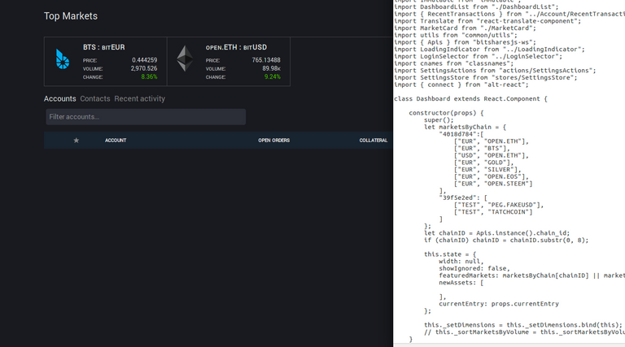
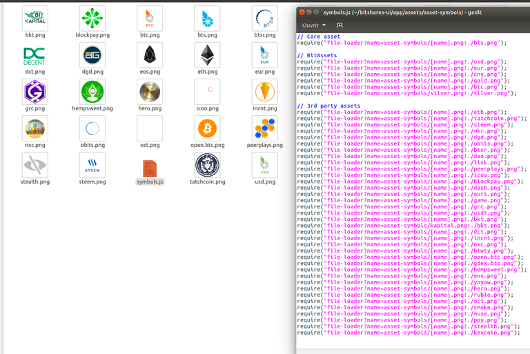

# Distributed Access to the BitShares Decentralised Exchange

**[ihashfury (56)](/@ihashfury)**in [#bitshares](/trending/bitshares) • 9 years ago (edited)

I hope to encourage and promote more access points and backup WebSocket (wss) gateways for BitShares. This is the logical progression from [Run your own decentralised exchange](https://steemit.com/bitshares/@ihashfury/run-your-own-decentralised-exchange "This link will take you away from hive.blog") post.  


### Distributed Access to the BitShares Network

[TOC]

### BitShares node setup post - [Run your own decentralised exchange](https://steemit.com/bitshares/@ihashfury/run-your-own-decentralised-exchange "This link will take you away from hive.blog")

Once you have a full node setup, you can allow BitShares shareholders secure access to your server to trade and check their accounts by following these steps.

> A DNS Alias (CNAME) is required to point to your server ip address.  
> 
> See [dyn.com](http://dyn.com "This link will take you away from hive.blog") for DNS Alias setup.  
> 
> You may have to wait a few days for the DNS to work through the internet.  
> 
> Please change [altcap.io](http://altcap.io "This link will take you away from hive.blog") to your DNS alias in the examples below.

## Create a New User

I recommend creating a new user on your server to run the Bitshares gui and give the user sudo access.

> You can use any name - I have used bitshares in this example

```
sudo adduser bitshares
sudo gpasswd -a bitshares sudo
sudo gpasswd -a bitshares users

```
## Install Nginx

Install Nginx web server

```
# ssh into your new user bitshares
ssh bitshares@altcap.io
sudo apt-get install nginx
# check version
nginx -v
# add user to web server group
sudo gpasswd -a bitshares www-data
# start nginx
sudo service nginx start

```

This will start Nginx default web server. Check it by typing the ip address of your server in a web browser or your alias [altcap.io](http://altcap.io "This link will take you away from hive.blog")

### Configure Nginx

To configure the web server, edit the default site and save as new DNS alias name using http port 80 only until you setup [letsencrypt.org](https://letsencrypt.org/ "This link will take you away from hive.blog") SSL Certificate.

### Create your web folder

```
sudo mkdir -p /var/www/altcap.io/public_html
sudo chown -R bitshares:bitshares var/www/altcap.io/public_html
sudo chmod 755 /var/www

```
### Configure Nginx

```
# edit default setup and save as altcap.io
sudo nano /etc/nginx/sites-available/default

```

Point to your new virtual host

```
###### altcap.io ######
server {
    listen 80;
    server_name altcap.io;
    #rewrite ^ https://$server_name$request_uri? permanent;
    #rewrite ^ https://altcap.io$uri permanent;
    #
    root /var/www/altcap.io/public_html;
    # Add index.php to the list if you are using PHP
    index index.html index.htm;
    #
    location / {
        # First attempt to serve request as file, then
        # as directory, then fall back to displaying a 404.
        try_files $uri $uri/ =404;
    }
}

```
> CTRL+O to save as altcap.io (^O Write Out)

### Update Virtual Host File

```
sudo cp altcap.io /etc/nginx/sites-available/altcap.io

```
### Activate sim link and disable default web server

```
sudo ln -s /etc/nginx/sites-available/altcap.io /etc/nginx/sites-enabled/altcap.io
sudo rm /etc/nginx/sites-enabled/default

```
### Link local folder to www root and add a simple index.html

```
ln -s /var/www/altcap.io/public_html ~/public_html
nano ~/public_html/index.html

```

Add some text to index.html

```
altcap.io

```
> CTRL+X to save as index.html (^X Exit)

### Restart Nginx

```
sudo service nginx restart

```

Now you have setup a simple web server.  

DigitalOcean has a great [article](https://www.digitalocean.com/community/articles/how-to-set-up-nginx-virtual-hosts-server-blocks-on-ubuntu-12-04-lts--3 "This link will take you away from hive.blog") for more information on Virtual Host setup.

## Install letsencrypt

```
sudo apt-get install letsencrypt

```
### Obtain your SSL certificate

```
sudo letsencrypt certonly --webroot -w /var/www/altcap.io/public_html -d altcap.io

```

Follow the instructions and add an email address

### Check your certificate

```
sudo ls -l /etc/letsencrypt/live/altcap.io
# and check it will update
sudo letsencrypt renew --dry-run --agree-tos
sudo letsencrypt renew

```
### Setup a renew cronjob for your new SSL certificate

```
sudo crontab -e

```

Add this line to run the job every 6 hours on the 16th minute

```
16 */6 * * *  /usr/bin/letsencrypt renew >> /var/log/letsencrypt-renew.log

```
> CTRL+X to save (^X Exit)

```
# check your crontab
sudo crontab -l

```
### Generate Strong Diffie-Hellman Group cert

```
sudo openssl dhparam -out /etc/ssl/certs/dhparam.pem 2048

```
## Add SSL to Nginx settings

Make a copy of altcap.io just in case.

```
cp altcap.io alcap.io.no.ssl

```
### Edit altcap.io

```
nano altcap.io

```
```
###### altcap.io ######
server {
    listen 80;
    server_name altcap.io;
    #rewrite ^ https://$server_name$request_uri? permanent;
    rewrite ^ https://altcap.io$uri permanent;
    #
    root /var/www/altcap.io/public_html;
    # Add index.php to the list if you are using PHP
    index index.html index.htm;
    #
    location / {
        # First attempt to serve request as file, then
        # as directory, then fall back to displaying a 404.
        try_files $uri $uri/ =404;
    }
}

###### altcap.io websockets

upstream websockets {
    server localhost:8090;
}

###### altcap.io ssl
server {
    listen 443 ssl;
    #
    server_name altcap.io;
    #
    root /var/www/altcap.io/public_html;
    # Add index.php to the list if you are using PHP
    index index.html index.htm;
    #
    ssl_certificate /etc/letsencrypt/live/altcap.io/fullchain.pem;
    ssl_certificate_key /etc/letsencrypt/live/altcap.io/privkey.pem;
    #
    ssl_protocols TLSv1 TLSv1.1 TLSv1.2;
    ssl_prefer_server_ciphers on;
    ssl_dhparam /etc/ssl/certs/dhparam.pem;
    ssl_ciphers 'ECDHE-RSA-AES128-GCM-SHA256:ECDHE-ECDSA-AES128-GCM-SHA256:ECDHE-RSA-AES256-GCM-SHA384:ECDHE-ECDSA-AES256-GCM-SHA384:DHE-RSA-AES128-GCM-SHA256:DHE-DSS-AES128-GCM-SHA256:kEDH+AESGCM:ECDHE-RSA-AES128-SHA256:ECDHE-ECDSA-AES128-SHA256:ECDHE-RSA-AES128-SHA:ECDHE-ECDSA-AES128-SHA:ECDHE-RSA-AES256-SHA384:ECDHE-ECDSA-AES256-SHA384:ECDHE-RSA-AES256-SHA:ECDHE-ECDSA-AES256-SHA:DHE-RSA-AES128-SHA256:DHE-RSA-AES128-SHA:DHE-DSS-AES128-SHA256:DHE-RSA-AES256-SHA256:DHE-DSS-AES256-SHA:DHE-RSA-AES256-SHA:AES128-GCM-SHA256:AES256-GCM-SHA384:AES128-SHA256:AES256-SHA256:AES128-SHA:AES256-SHA:AES:CAMELLIA:DES-CBC3-SHA:!aNULL:!eNULL:!EXPORT:!DES:!RC4:!MD5:!PSK:!aECDH:!EDH-DSS-DES-CBC3-SHA:!EDH-RSA-DES-CBC3-SHA:!KRB5-DES-CBC3-SHA';
    ssl_session_timeout 1d;
    ssl_session_cache shared:SSL:50m;
    ssl_stapling on;
    ssl_stapling_verify on;
    add_header Strict-Transport-Security max-age=15768000;
    #
    # Note: You should disable gzip for SSL traffic.
    # See: https://bugs.debian.org/773332
    #
    # Read up on ssl_ciphers to ensure a secure configuration.
    # See: https://bugs.debian.org/765782
    #
    # Self signed certs generated by the ssl-cert package
    # Don't use them in a production server!
    #
    # include snippets/snakeoil.conf;
    #
    location / {
        # First attempt to serve request as file, then
        # as directory, then fall back to displaying a 404.
        try_files $uri $uri/ =404;
    }
    location ~ /ws/? {
        access_log off;
        proxy_pass http://websockets;
        proxy_set_header X-Real-IP $remote_addr;
        proxy_set_header Host $host;
        proxy_set_header X-Forwarded-For $proxy_add_x_forwarded_for;
        proxy_http_version 1.1;
        proxy_set_header Upgrade $http_upgrade;
        proxy_set_header Connection "upgrade";
    }
}
###### altcap.io ######

```
> CTRL+X to save (^X Exit)

You have now setup an SSL secured web server with a WebSocket connected to your local BitShares witness\_node (listening on port 8090 - see [this post](https://steemit.com/bitshares/@ihashfury/run-your-own-decentralised-exchange "This link will take you away from hive.blog") for more information)

### Update altcap.io www virtual host

```
sudo cp altcap.io /etc/nginx/sites-available/altcap.io

```
### Restart Nginx

```
sudo service nginx restart

```

Now you have setup an SSL web server.  

More information on SSL setup can be found here.  

[DigitalOcean letsencrypt SSL](https://www.digitalocean.com/community/tutorials/how-to-secure-nginx-with-let-s-encrypt-on-ubuntu-14-04 "This link will take you away from hive.blog")  

[LetsEncrypt](https://letsencrypt.org/ "This link will take you away from hive.blog")  

[CertBot](https://certbot.eff.org/ "This link will take you away from hive.blog")

## Install BitShares web gui

### Install NVM (Node Version Manager)

```
curl -o- https://raw.githubusercontent.com/creationix/nvm/v0.30.2/install.sh | bash

```

exit bash (terminal) and reconnect

```
ssh [[email protected]](/cdn-cgi/l/email-protection)
nvm install v5
nvm use v5

```
### Download BitShares gui

```
git clone https://github.com/bitshares/bitshares-2-ui.git

```
### Setup light wallet

```
cd /bitshares-2-ui/

```

Before building the light wallet, you need to edit **SettingsStore.js** line 19 and 99 wss WebSocket.

```
nano /bitshares-2-ui/dl/src/stores/SettingsStore.js

```

Change line 19

```
            connection: "wss://altcap.io/ws",

```

Add your new wss WebSocket to line 99

```
            connection: [
                "wss://altcap.io/ws",
                "wss://bitshares.openledger.info/ws",
                "wss://bitshares.dacplay.org:8089/ws",
                "wss://dele-puppy.com/ws",
                "wss://valen-tin.fr:8090/ws"

```
> CTRL+X to save (^X Exit)

```
### Setup install
cd dl; npm install
cd ../web; npm install

```
### Link web root to gui build folder

```
ln -s ~/public_html/ dist

```
### Build light wallet

```
npm run build

```

You have now created another Access point to the BitShares Decentralised Exchange.  

**The more the merrier.**  

Please remember to check your firewall and SSH is up-to-date and configured correctly. DigitalOcean has [firewall](https://www.digitalocean.com/community/tags/firewall?type=tutorials "This link will take you away from hive.blog") and [Secure SSH](https://www.digitalocean.com/community/tutorials/how-to-set-up-ssh-keys--2 "This link will take you away from hive.blog") tutorials for more help.

## SSL test

You can also check how secure your new web server is compared to your bank. Add this link to a web browser and wait for the results.

```
https://www.ssllabs.com/ssltest/analyze.html?d=altcap.io

```

Now change altcap.io to your local bank's domain name in the link and post the results below.

> **Thank you [svk](https://steemit.com/@svk "This link will take you away from hive.blog") for your advice and guidance.**

 [#rewrite](/trending/rewrite) 9 years ago in [#bitshares](/trending/bitshares) by **[ihashfury (56)](/@ihashfury)**[$32.97](#)

* Past Payouts $32.97
* - Author $19.02
* - Curators $13.95
[38 votes](#)

* [enki: $8.05](/@enki)
* [roadscape: $7.33](/@roadscape)
* [complexring: $5.31](/@complexring)
* [lafona-miner: $4.81](/@lafona-miner)
* [newyo: $1.80](/@newyo)
* [ihashfury: $1.68](/@ihashfury)
* [xeroc: $1.50](/@xeroc)
* [berkah: $0.68](/@berkah)
* [lafona: $0.37](/@lafona)
* [sandra: $0.21](/@sandra)
* [pheonike: $0.20](/@pheonike)
* [clains: $0.20](/@clains)
* [pfunk: $0.17](/@pfunk)
* [psylains: $0.11](/@psylains)
* [jason: $0.11](/@jason)
* [idealist: $0.09](/@idealist)
* [rnglab: $0.09](/@rnglab)
* [noisy: $0.06](/@noisy)
* [rimantas: $0.04](/@rimantas)
* [proctologic: $0.04](/@proctologic)
* and 18 more
Reply    [27](/bitshares/@ihashfury/distributed-access-to-the-bitshares-decentralised-exchange "27 Responses")


Sort:- [Trending](#)
  * [Trending](/bitshares/@ihashfury/distributed-access-to-the-bitshares-decentralised-exchange?sort=trending#comments)
  * [Votes](/bitshares/@ihashfury/distributed-access-to-the-bitshares-decentralised-exchange?sort=votes#comments)
  * [Age](/bitshares/@ihashfury/distributed-access-to-the-bitshares-decentralised-exchange?sort=new#comments)
[-]**[shing3e (44)](/@shing3e)** [9 years ago](/bitshares/@ihashfury/distributed-access-to-the-bitshares-decentralised-exchange#@shing3e/re-ihashfury-distributed-access-to-the-bitshares-decentralised-exchange-20160801t095737079z)  

Thanks for the security check tip!

[$0.70](#)

* Past Payouts $0.70
* - Author $0.53
* - Curators $0.17
[2 votes](#)

* [ihashfury: $0.68](/@ihashfury)
* [jason: $0.02](/@jason)
Reply   [-]**[sandra (62)](/@sandra)** [9 years ago](/bitshares/@ihashfury/distributed-access-to-the-bitshares-decentralised-exchange#@sandra/re-ihashfury-distributed-access-to-the-bitshares-decentralised-exchange-20160630t101955925z)  

SSL Certificate Overall Rating results:  

altcap.io - A+  

security.hsbc.co.uk - B  

meine.deutsche-bank.de - A  

globalmarkets.bnpparibas.com - A  

particulares.gruposantander.es - A-  

bmn.es - F

[$0.55](#)

* Past Payouts $0.55
* - Author $0.55
* - Curators $0.01
[3 votes](#)

* [ihashfury: $0.52](/@ihashfury)
* [jason: $0.03](/@jason)
* [sandra: $0.01](/@sandra)
Reply   [-]**[xeroc (70)](/@xeroc)** [9 years ago](/bitshares/@ihashfury/distributed-access-to-the-bitshares-decentralised-exchange#@xeroc/re-ihashfury-distributed-access-to-the-bitshares-decentralised-exchange-20160629t132103889z)  

For proper markdown, you need to have a blank space after `##` for headlines. If you could please correct that ..

[$0.41](#)

* Past Payouts $0.41
* - Author $0.20
* - Curators $0.20
[2 votes](#)

* [ihashfury: $0.40](/@ihashfury)
* [judyhopps: $0.00](/@judyhopps)
Reply   [-]**[roseebit (63)](/@roseebit)** [9 years ago](/bitshares/@ihashfury/distributed-access-to-the-bitshares-decentralised-exchange#@roseebit/re-ihashfury-distributed-access-to-the-bitshares-decentralised-exchange-20160630t000440751z)  

Good

[$0.07](#)

* Past Payouts $0.07
* - Author $0.07
* - Curators $0.00
[3 votes](#)

* [ihashfury: $0.07](/@ihashfury)
* [sandra: $0.00](/@sandra)
* [aleks123rus: $0.00](/@aleks123rus)
Reply   [-]**[tatchcapital (47)](/@tatchcapital)** [7 years ago](/bitshares/@ihashfury/distributed-access-to-the-bitshares-decentralised-exchange#@tatchcapital/re-ihashfury-distributed-access-to-the-bitshares-decentralised-exchange-20171229t114541623z)  

Hello [@ihashfury](/@ihashfury) !

I'm trying to distribute a customized UI. It seems I don't 'need' to run a full node to do so and everything is running ok.

BUT I can't change the Dashboard as it doesn't display what I request. Can't find what am I missing ?

Any help would be very much appreciated !





I have allowed pairs in Store settings too so I am really puzzled here

$0.00

[1 vote](#)

* [tatchcapital](/@tatchcapital)
Reply   [-]**[teamsteem (74)](/@teamsteem)** [8 years ago](/bitshares/@ihashfury/distributed-access-to-the-bitshares-decentralised-exchange#@teamsteem/re-ihashfury-distributed-access-to-the-bitshares-decentralised-exchange-20160823t003055401z)  

Thank you [@ihashfury](/@ihashfury) for your recognition! Looking at that post you seem very knowledgeable in regard to Bitshares! It would be a real pleasure to talk to you in private. I just saw that your witness is doing really good. You can check me up on the Steemit official chat if you have time.

$0.00

Reply   [-]**[steemitboard (66)](/@steemitboard)** [8 years ago](/bitshares/@ihashfury/distributed-access-to-the-bitshares-decentralised-exchange#@steemitboard/steemitboard-notify-ihashfury-20170630t034402000z)  

Congratulations [@ihashfury](/@ihashfury)! You have completed some achievement on Steemit and have been rewarded with new badge(s) :

[](http://steemitboard.com/@ihashfury "This link will take you away from hive.blog") Award for the number of upvotes

Click on any badge to view your own Board of Honnor on SteemitBoard.  

For more information about SteemitBoard, click [here](https://steemit.com/@steemitboard "This link will take you away from hive.blog")

If you no longer want to receive notifications, reply to this comment with the word `STOP`

By upvoting this notification, you can help all Steemit users. Learn how [here](https://steemit.com/steemitboard/@steemitboard/http-i-cubeupload-com-7ciqeo-png "This link will take you away from hive.blog")!

$0.00

Reply   [-]**[steemitboard (66)](/@steemitboard)** [8 years ago](/bitshares/@ihashfury/distributed-access-to-the-bitshares-decentralised-exchange#@steemitboard/steemitboard-notify-ihashfury-20170704t140508000z)  

Congratulations [@ihashfury](/@ihashfury)! You have completed some achievement on Steemit and have been rewarded with new badge(s) :

[](http://steemitboard.com/@ihashfury "This link will take you away from hive.blog") Award for the number of upvotes

Click on any badge to view your own Board of Honor on SteemitBoard.  

For more information about SteemitBoard, click [here](https://steemit.com/@steemitboard "This link will take you away from hive.blog")

If you no longer want to receive notifications, reply to this comment with the word `STOP`

> By upvoting this notification, you can help all Steemit users. Learn how [here](https://steemit.com/steemitboard/@steemitboard/http-i-cubeupload-com-7ciqeo-png "This link will take you away from hive.blog")!

$0.00

Reply   [-]**[steemitboard (66)](/@steemitboard)** [8 years ago](/bitshares/@ihashfury/distributed-access-to-the-bitshares-decentralised-exchange#@steemitboard/steemitboard-notify-ihashfury-20170706t215529000z)  

Congratulations [@ihashfury](/@ihashfury)! You have completed some achievement on Steemit and have been rewarded with new badge(s) :

[](http://steemitboard.com/@ihashfury "This link will take you away from hive.blog") Award for the number of upvotes

Click on any badge to view your own Board of Honor on SteemitBoard.  

For more information about SteemitBoard, click [here](https://steemit.com/@steemitboard "This link will take you away from hive.blog")

If you no longer want to receive notifications, reply to this comment with the word `STOP`

> By upvoting this notification, you can help all Steemit users. Learn how [here](https://steemit.com/steemitboard/@steemitboard/http-i-cubeupload-com-7ciqeo-png "This link will take you away from hive.blog")!

$0.00

Reply   [-]**[steemitboard (66)](/@steemitboard)** [8 years ago](/bitshares/@ihashfury/distributed-access-to-the-bitshares-decentralised-exchange#@steemitboard/steemitboard-notify-ihashfury-20170712t223611000z)  

Congratulations [@ihashfury](/@ihashfury)! You have completed some achievement on Steemit and have been rewarded with new badge(s) :

[](http://steemitboard.com/@ihashfury "This link will take you away from hive.blog") Award for the number of upvotes

Click on any badge to view your own Board of Honor on SteemitBoard.  

For more information about SteemitBoard, click [here](https://steemit.com/@steemitboard "This link will take you away from hive.blog")

If you no longer want to receive notifications, reply to this comment with the word `STOP`

> By upvoting this notification, you can help all Steemit users. Learn how [here](https://steemit.com/steemitboard/@steemitboard/http-i-cubeupload-com-7ciqeo-png "This link will take you away from hive.blog")!

$0.00

Reply   [-]**[steemitboard (66)](/@steemitboard)** [8 years ago](/bitshares/@ihashfury/distributed-access-to-the-bitshares-decentralised-exchange#@steemitboard/steemitboard-notify-ihashfury-20170723t160208000z)  

Congratulations [@ihashfury](/@ihashfury)! You have completed some achievement on Steemit and have been rewarded with new badge(s) :

[](http://steemitboard.com/@ihashfury "This link will take you away from hive.blog") Award for the number of upvotes

Click on any badge to view your own Board of Honor on SteemitBoard.  

For more information about SteemitBoard, click [here](https://steemit.com/@steemitboard "This link will take you away from hive.blog")

If you no longer want to receive notifications, reply to this comment with the word `STOP`

> By upvoting this notification, you can help all Steemit users. Learn how [here](https://steemit.com/steemitboard/@steemitboard/http-i-cubeupload-com-7ciqeo-png "This link will take you away from hive.blog")!

$0.00

Reply   [-]**[steemitboard (66)](/@steemitboard)** [8 years ago](/bitshares/@ihashfury/distributed-access-to-the-bitshares-decentralised-exchange#@steemitboard/steemitboard-notify-ihashfury-20170728t172323000z)  

Congratulations [@ihashfury](/@ihashfury)! You have completed some achievement on Steemit and have been rewarded with new badge(s) :

[](http://steemitboard.com/@ihashfury "This link will take you away from hive.blog") Award for the number of upvotes

Click on any badge to view your own Board of Honor on SteemitBoard.  

For more information about SteemitBoard, click [here](https://steemit.com/@steemitboard "This link will take you away from hive.blog")

If you no longer want to receive notifications, reply to this comment with the word `STOP`

> By upvoting this notification, you can help all Steemit users. Learn how [here](https://steemit.com/steemitboard/@steemitboard/http-i-cubeupload-com-7ciqeo-png "This link will take you away from hive.blog")!

$0.00

Reply   [-]**[steemitboard (66)](/@steemitboard)** [8 years ago](/bitshares/@ihashfury/distributed-access-to-the-bitshares-decentralised-exchange#@steemitboard/steemitboard-notify-ihashfury-20170810t220908000z)  

Congratulations [@ihashfury](/@ihashfury)! You have completed some achievement on Steemit and have been rewarded with new badge(s) :

[](http://steemitboard.com/@ihashfury "This link will take you away from hive.blog") Award for the number of upvotes

Click on any badge to view your own Board of Honor on SteemitBoard.  

For more information about SteemitBoard, click [here](https://steemit.com/@steemitboard "This link will take you away from hive.blog")

If you no longer want to receive notifications, reply to this comment with the word `STOP`

> By upvoting this notification, you can help all Steemit users. Learn how [here](https://steemit.com/steemitboard/@steemitboard/http-i-cubeupload-com-7ciqeo-png "This link will take you away from hive.blog")!

$0.00

Reply   [-]**[steemitboard (66)](/@steemitboard)** [8 years ago](/bitshares/@ihashfury/distributed-access-to-the-bitshares-decentralised-exchange#@steemitboard/steemitboard-notify-ihashfury-20170814t153341000z)  

Congratulations [@ihashfury](/@ihashfury)! You have completed some achievement on Steemit and have been rewarded with new badge(s) :

[](http://steemitboard.com/@ihashfury "This link will take you away from hive.blog") Award for the number of upvotes

Click on any badge to view your own Board of Honor on SteemitBoard.  

For more information about SteemitBoard, click [here](https://steemit.com/@steemitboard "This link will take you away from hive.blog")

If you no longer want to receive notifications, reply to this comment with the word `STOP`

> By upvoting this notification, you can help all Steemit users. Learn how [here](https://steemit.com/steemitboard/@steemitboard/http-i-cubeupload-com-7ciqeo-png "This link will take you away from hive.blog")!

$0.00

Reply   [-]**[steemitboard (66)](/@steemitboard)** [7 years ago](/bitshares/@ihashfury/distributed-access-to-the-bitshares-decentralised-exchange#@steemitboard/steemitboard-notify-ihashfury-20170822t132744000z)  

Congratulations [@ihashfury](/@ihashfury)! You have completed some achievement on Steemit and have been rewarded with new badge(s) :

[](http://steemitboard.com/@ihashfury "This link will take you away from hive.blog") Award for the number of upvotes

Click on any badge to view your own Board of Honor on SteemitBoard.  

For more information about SteemitBoard, click [here](https://steemit.com/@steemitboard "This link will take you away from hive.blog")

If you no longer want to receive notifications, reply to this comment with the word `STOP`

> By upvoting this notification, you can help all Steemit users. Learn how [here](https://steemit.com/steemitboard/@steemitboard/http-i-cubeupload-com-7ciqeo-png "This link will take you away from hive.blog")!

$0.00

Reply   [-]**[steemitboard (66)](/@steemitboard)** [7 years ago](/bitshares/@ihashfury/distributed-access-to-the-bitshares-decentralised-exchange#@steemitboard/steemitboard-notify-ihashfury-20170824t180814000z)  

Congratulations [@ihashfury](/@ihashfury)! You have completed some achievement on Steemit and have been rewarded with new badge(s) :

[](http://steemitboard.com/@ihashfury "This link will take you away from hive.blog") Award for the number of upvotes

Click on any badge to view your own Board of Honor on SteemitBoard.  

For more information about SteemitBoard, click [here](https://steemit.com/@steemitboard "This link will take you away from hive.blog")

If you no longer want to receive notifications, reply to this comment with the word `STOP`

> By upvoting this notification, you can help all Steemit users. Learn how [here](https://steemit.com/steemitboard/@steemitboard/http-i-cubeupload-com-7ciqeo-png "This link will take you away from hive.blog")!

$0.00

Reply   [-]**[steemitboard (66)](/@steemitboard)** [7 years ago](/bitshares/@ihashfury/distributed-access-to-the-bitshares-decentralised-exchange#@steemitboard/steemitboard-notify-ihashfury-20170827t005402000z)  

Congratulations [@ihashfury](/@ihashfury)! You have completed some achievement on Steemit and have been rewarded with new badge(s) :

[](http://steemitboard.com/@ihashfury "This link will take you away from hive.blog") Award for the number of upvotes

Click on any badge to view your own Board of Honor on SteemitBoard.  

For more information about SteemitBoard, click [here](https://steemit.com/@steemitboard "This link will take you away from hive.blog")

If you no longer want to receive notifications, reply to this comment with the word `STOP`

> By upvoting this notification, you can help all Steemit users. Learn how [here](https://steemit.com/steemitboard/@steemitboard/http-i-cubeupload-com-7ciqeo-png "This link will take you away from hive.blog")!

$0.00

Reply   [-]**[steemitboard (66)](/@steemitboard)** [7 years ago](/bitshares/@ihashfury/distributed-access-to-the-bitshares-decentralised-exchange#@steemitboard/steemitboard-notify-ihashfury-20170901t010820000z)  

Congratulations [@ihashfury](/@ihashfury)! You have completed some achievement on Steemit and have been rewarded with new badge(s) :

[](http://steemitboard.com/@ihashfury "This link will take you away from hive.blog") Award for the number of upvotes

Click on any badge to view your own Board of Honor on SteemitBoard.  

For more information about SteemitBoard, click [here](https://steemit.com/@steemitboard "This link will take you away from hive.blog")

If you no longer want to receive notifications, reply to this comment with the word `STOP`

> By upvoting this notification, you can help all Steemit users. Learn how [here](https://steemit.com/steemitboard/@steemitboard/http-i-cubeupload-com-7ciqeo-png "This link will take you away from hive.blog")!

$0.00

Reply   [-]**[steemitboard (66)](/@steemitboard)** [7 years ago](/bitshares/@ihashfury/distributed-access-to-the-bitshares-decentralised-exchange#@steemitboard/steemitboard-notify-ihashfury-20170903t111947000z)  

Congratulations [@ihashfury](/@ihashfury)! You have completed some achievement on Steemit and have been rewarded with new badge(s) :

[](http://steemitboard.com/@ihashfury "This link will take you away from hive.blog") Award for the number of upvotes

Click on any badge to view your own Board of Honor on SteemitBoard.  

For more information about SteemitBoard, click [here](https://steemit.com/@steemitboard "This link will take you away from hive.blog")

If you no longer want to receive notifications, reply to this comment with the word `STOP`

> By upvoting this notification, you can help all Steemit users. Learn how [here](https://steemit.com/steemitboard/@steemitboard/http-i-cubeupload-com-7ciqeo-png "This link will take you away from hive.blog")!

$0.00

Reply   [-]**[steemitboard (66)](/@steemitboard)** [7 years ago](/bitshares/@ihashfury/distributed-access-to-the-bitshares-decentralised-exchange#@steemitboard/steemitboard-notify-ihashfury-20170905t205708000z)  

Congratulations [@ihashfury](/@ihashfury)! You have completed some achievement on Steemit and have been rewarded with new badge(s) :

[](http://steemitboard.com/@ihashfury "This link will take you away from hive.blog") Award for the number of upvotes

Click on any badge to view your own Board of Honor on SteemitBoard.  

For more information about SteemitBoard, click [here](https://steemit.com/@steemitboard "This link will take you away from hive.blog")

If you no longer want to receive notifications, reply to this comment with the word `STOP`

> By upvoting this notification, you can help all Steemit users. Learn how [here](https://steemit.com/steemitboard/@steemitboard/http-i-cubeupload-com-7ciqeo-png "This link will take you away from hive.blog")!

$0.00

Reply   [-]**[steemitboard (66)](/@steemitboard)** [7 years ago](/bitshares/@ihashfury/distributed-access-to-the-bitshares-decentralised-exchange#@steemitboard/steemitboard-notify-ihashfury-20170910t132129000z)  

Congratulations [@ihashfury](/@ihashfury)! You have completed some achievement on Steemit and have been rewarded with new badge(s) :

[](http://steemitboard.com/@ihashfury "This link will take you away from hive.blog") Award for the number of upvotes

Click on any badge to view your own Board of Honor on SteemitBoard.  

For more information about SteemitBoard, click [here](https://steemit.com/@steemitboard "This link will take you away from hive.blog")

If you no longer want to receive notifications, reply to this comment with the word `STOP`

> By upvoting this notification, you can help all Steemit users. Learn how [here](https://steemit.com/steemitboard/@steemitboard/http-i-cubeupload-com-7ciqeo-png "This link will take you away from hive.blog")!

$0.00

Reply   [-]**[steemitboard (66)](/@steemitboard)** [7 years ago](/bitshares/@ihashfury/distributed-access-to-the-bitshares-decentralised-exchange#@steemitboard/steemitboard-notify-ihashfury-20170919t061414000z)  

Congratulations [@ihashfury](/@ihashfury)! You have completed some achievement on Steemit and have been rewarded with new badge(s) :

[](http://steemitboard.com/@ihashfury "This link will take you away from hive.blog") Award for the number of upvotes

Click on any badge to view your own Board of Honor on SteemitBoard.  

For more information about SteemitBoard, click [here](https://steemit.com/@steemitboard "This link will take you away from hive.blog")

If you no longer want to receive notifications, reply to this comment with the word `STOP`

> By upvoting this notification, you can help all Steemit users. Learn how [here](https://steemit.com/steemitboard/@steemitboard/http-i-cubeupload-com-7ciqeo-png "This link will take you away from hive.blog")!

$0.00

Reply   [-]**[steemitboard (66)](/@steemitboard)** [7 years ago](/bitshares/@ihashfury/distributed-access-to-the-bitshares-decentralised-exchange#@steemitboard/steemitboard-notify-ihashfury-20170921t162347000z)  

Congratulations [@ihashfury](/@ihashfury)! You have completed some achievement on Steemit and have been rewarded with new badge(s) :

[](http://steemitboard.com/@ihashfury "This link will take you away from hive.blog") Award for the number of upvotes

Click on any badge to view your own Board of Honor on SteemitBoard.  

For more information about SteemitBoard, click [here](https://steemit.com/@steemitboard "This link will take you away from hive.blog")

If you no longer want to receive notifications, reply to this comment with the word `STOP`

> By upvoting this notification, you can help all Steemit users. Learn how [here](https://steemit.com/steemitboard/@steemitboard/http-i-cubeupload-com-7ciqeo-png "This link will take you away from hive.blog")!

$0.00

Reply   [-]**[steemitboard (66)](/@steemitboard)** [7 years ago](/bitshares/@ihashfury/distributed-access-to-the-bitshares-decentralised-exchange#@steemitboard/steemitboard-notify-ihashfury-20171127t184133000z)  

Congratulations [@ihashfury](/@ihashfury)! You have completed some achievement on Steemit and have been rewarded with new badge(s) :

[](http://steemitboard.com/@ihashfury "This link will take you away from hive.blog") Award for the number of upvotes

Click on any badge to view your own Board of Honor on SteemitBoard.  

For more information about SteemitBoard, click [here](https://steemit.com/@steemitboard "This link will take you away from hive.blog")

If you no longer want to receive notifications, reply to this comment with the word `STOP`

> By upvoting this notification, you can help all Steemit users. Learn how [here](https://steemit.com/steemitboard/@steemitboard/http-i-cubeupload-com-7ciqeo-png "This link will take you away from hive.blog")!

$0.00

Reply   [-]**[steemitboard (66)](/@steemitboard)** [7 years ago](/bitshares/@ihashfury/distributed-access-to-the-bitshares-decentralised-exchange#@steemitboard/steemitboard-notify-ihashfury-20171224t014556000z)  

Congratulations [@ihashfury](/@ihashfury)! You have completed some achievement on Steemit and have been rewarded with new badge(s) :

[](http://steemitboard.com/@ihashfury "This link will take you away from hive.blog") Award for the number of upvotes

Click on any badge to view your own Board of Honor on SteemitBoard.  

For more information about SteemitBoard, click [here](https://steemit.com/@steemitboard "This link will take you away from hive.blog")

If you no longer want to receive notifications, reply to this comment with the word `STOP`

> By upvoting this notification, you can help all Steemit users. Learn how [here](https://steemit.com/steemitboard/@steemitboard/http-i-cubeupload-com-7ciqeo-png "This link will take you away from hive.blog")!

$0.00

Reply   [-]**[steemitboard (66)](/@steemitboard)** [7 years ago](/bitshares/@ihashfury/distributed-access-to-the-bitshares-decentralised-exchange#@steemitboard/steemitboard-notify-ihashfury-20180109t212642000z)  

Congratulations [@ihashfury](/@ihashfury)! You have completed some achievement on Steemit and have been rewarded with new badge(s) :

[](http://steemitboard.com/@ihashfury "This link will take you away from hive.blog") Award for the number of upvotes

Click on any badge to view your own Board of Honor on SteemitBoard.  

For more information about SteemitBoard, click [here](https://steemit.com/@steemitboard "This link will take you away from hive.blog")

If you no longer want to receive notifications, reply to this comment with the word `STOP`

> By upvoting this notification, you can help all Steemit users. Learn how [here](https://steemit.com/steemitboard/@steemitboard/http-i-cubeupload-com-7ciqeo-png "This link will take you away from hive.blog")!

$0.00

Reply   [-]**[steemitboard (66)](/@steemitboard)** [6 years ago](/bitshares/@ihashfury/distributed-access-to-the-bitshares-decentralised-exchange#@steemitboard/steemitboard-notify-ihashfury-20190404t171832000z)  

Congratulations [@ihashfury](/@ihashfury)! You received a personal award!

|  | Happy Birthday! - You are on the Steem blockchain for 3 years! |
| --- | --- |

*You can view [your badges on your Steem Board](https://steemitboard.com/@ihashfury "This link will take you away from hive.blog") and compare to others on the [Steem Ranking](http://steemitboard.com/ranking/index.php?name=ihashfury "This link will take you away from hive.blog")*

**Do not miss the last post from [@steemitboard](/@steemitboard):**

|  | [The Steem blockchain survived its first virus plague!](https://steemit.com/steemitboard/@steemitboard/the-steem-blockchain-survived-its-first-virus-plague "This link will take you away from hive.blog") |
| --- | --- |

###### [Vote for @Steemitboard as a witness](https://v2.steemconnect.com/sign/account-witness-vote?witness=steemitboard&approve=1 "This link will take you away from hive.blog") to get one more award and increased upvotes!

$0.00

Reply   